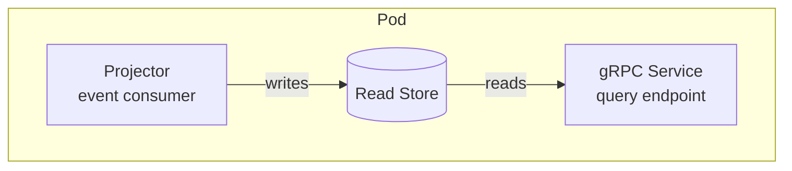
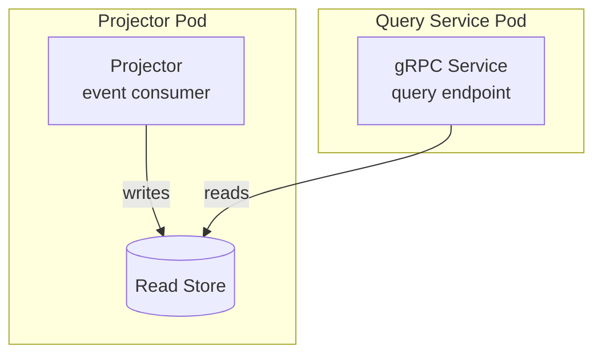

import BlogHeader from '@site/src/components/BlogHeader';

<BlogHeader />

**Yes.** For most systems, projectors should serve their own data. Run the projector and its gRPC query endpoint in the same pod. Split them when scaling demands it—not before.

This applies more broadly: collocate components that don't yet need separation, define interfaces as if they were separate, and split when reality demands it. Angzarr will soon apply this same principle to sagas, allowing them to run directly inside aggregate command handlers—with a clean extraction path when they outgrow it.

<!-- truncate -->

## The Recommendation

Put the projector, read store, and gRPC query service in one pod:

When query load overwhelms the pod, or projection lag degrades query latency, or you need to scale reads independently—pull the gRPC service into its own pod:

The interface doesn't change. Clients don't know the difference. You've scaled without redesigning.

## Why This Works

The gRPC service has its own interface definition from day one. The read store already sits between the projector and the query logic. Splitting them apart is a deployment change, not an architecture change—you're moving a process boundary, not redesigning a system.

Separating the projector from the query service in a low-traffic system buys you an extra pod to deploy, monitor, and debug; network hops you didn't need; a coordination problem when the read schema changes; and complexity that exists to solve a scaling problem you don't have.

This is a tradeoff of correctness versus complexity. **Complexity reduction should generally win, as long as it can be corrected when it becomes important.** The "correct" architecture solves real problems—independent scaling, isolation of projection lag, read model rebuilds without serving impact—but most systems don't have those problems yet.

## The Same Principle, Applied to Sagas

Angzarr will likely soon support incorporating sagas directly into aggregate roots and command handlers. Same motivation: for simple sagas tightly coupled to aggregate logic and not under independent load pressure, a separate saga pod is overhead without benefit. The aggregate handles the command, emits events, and performs the coordination—all in one place.

The constraint is identical: **it must be easy to peel back out.** When the saga becomes complex, when its scaling needs diverge, when a different team needs to own it—extraction should be straightforward. The saga's interface is already defined. Its coordination logic is already encapsulated. Moving it to its own process is a deployment decision, not a rewrite.

## When to Split from Day One

Not everything should start collocated. Split immediately when:

- **Load profiles are already divergent.** Hundreds of events per second into the projector, millions of queries per second out—these need independent scaling from the start.
- **Different teams own the read and write paths.** Conway's Law applies. Shared pods across team boundaries create deployment coupling.
- **The read model serves latency-critical paths.** If projection rebuilds can't impact query latency, process isolation is a correctness requirement, not an optimization.
- **Compliance or security boundaries require it.** Some read models serve sensitive data through restricted endpoints where process isolation is policy.

These are conditions you can evaluate at design time. If none apply, start simple.

## The Pattern

1. **Start simple.** Collocate components that don't yet need separation.
2. **Define interfaces as if they were separate.** gRPC services, saga protocols, clear boundaries in code.
3. **Split when the pressure appears.** Scaling bottlenecks, team ownership changes, reliability requirements.
4. **The split is mechanical, not architectural.** Because the interfaces already exist.

Build for the system you have. Design interfaces for the system you might need. Deploy the simplest topology that works.

---

*This post is part of an ongoing series on pragmatic architecture decisions in event-sourced systems. The opinions are informed by building [Angzarr](/) and deploying it in production—where elegance matters less than operability.*
