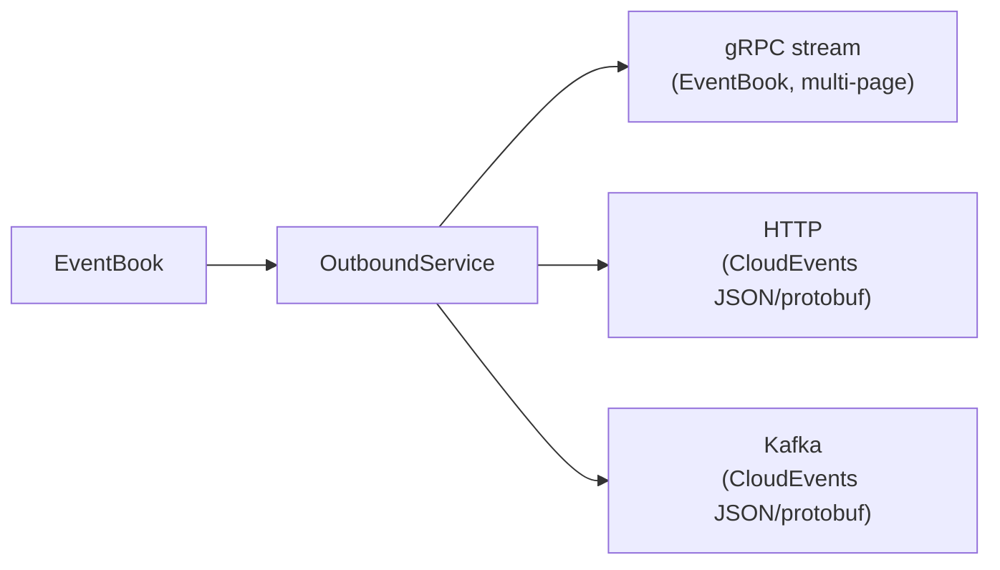

Angzarr provides several built-in projectors for common operational needs. These are framework-level services that process events without requiring custom business logic.

| Projector | Purpose | Output |
|-----------|---------|--------|
| [LogService](#logservice) | Debug logging | Console (stdout) |
| [EventService](#eventservice) | Event storage | Database (SQL) |
| [OutboundService](#outboundservice) | Real-time streaming + external publishing | gRPC streams, HTTP/Kafka |

---

## LogService

Pretty-prints events to stdout with optional JSON decoding. Useful for development debugging and monitoring event flow.

### Features

- ANSI color-coded output by event type
- JSON decoding via prost-reflect (if descriptors provided)
- Hex dump fallback for unknown types

### Configuration

| Variable | Description |
|----------|-------------|
| `DESCRIPTOR_PATH` | Path to `FileDescriptorSet` for JSON decoding |

### Output Example

```text title="illustrative - LogService console output"
────────────────────────────────────────────────────────
orders:abc123de:0000000005
OrderCreated
────────────────────────────────────────────────────────
  {
    "order_id": "ORD-12345",
    "customer_id": "CUST-789",
    "total": 9999
  }
```

### Color Coding

| Event Pattern | Color |
|---------------|-------|
| `*Created` | Green |
| `*Completed` | Cyan |
| `*Cancelled`, `*Failed` | Red |
| `*Added`, `*Applied` | Yellow |
| Other | Blue |

### Usage (Rust)

```rust title="illustrative - LogService usage"
use angzarr::handlers::projectors::{LogService, LogServiceHandle};

let service = LogService::new();

// Or with descriptors
std::env::set_var("DESCRIPTOR_PATH", "/path/to/descriptors.bin");
let service = LogService::new();

// Use as gRPC service
let handle = LogServiceHandle(Arc::new(service));
```

---

## EventService

Stores all events as JSON in a SQL database for querying, debugging, and audit trails.

### Features

- Stores events keyed by `(domain, root_id, sequence)`
- JSON decoding via prost-reflect
- Base64 fallback for unknown types
- Indexes for efficient querying by domain, type, correlation, time

### Database Support

- SQLite (feature: `sqlite`)
- PostgreSQL (feature: `postgres`)

### Schema

```sql title="illustrative - EventService schema"
CREATE TABLE events (
    domain TEXT NOT NULL,
    root_id TEXT NOT NULL,
    sequence INTEGER NOT NULL,
    event_type TEXT NOT NULL,
    event_json TEXT NOT NULL,
    correlation_id TEXT NOT NULL,
    created_at TEXT NOT NULL,
    PRIMARY KEY (domain, root_id, sequence)
);

-- Indexes
CREATE INDEX idx_events_domain_type ON events(domain, event_type);
CREATE INDEX idx_events_correlation ON events(correlation_id);
CREATE INDEX idx_events_created ON events(created_at);
```

### Queries

EventService exposes its reads over gRPC (and the REST gateway). Use the generated client — never query the backing store directly.

```python title="illustrative - EventService queries"
# All events for an aggregate
events = event_service.by_root(domain="orders", root_id="abc123")

# Events by type, newest first
recent = event_service.by_type(domain="orders", event_type="OrderCreated", limit=100)

# Trace a correlation flow
trace = event_service.by_correlation("corr-xyz-789")
```

### Usage (Rust)

```rust title="illustrative - EventService usage"
use angzarr::handlers::projectors::{EventService, EventServiceHandle, connect_pool};

let pool = connect_pool("sqlite:events.db").await?;
let service = EventService::new(pool)
    .load_descriptors("/path/to/descriptors.bin");

service.init().await?;  // Create schema

let handle = EventServiceHandle(Arc::new(service));
```

---

## OutboundService

Unified outbound projector for event streaming to both internal and external consumers. Combines gRPC streaming (for gateways) with CloudEvents publishing (for external systems).

### Architecture



### Features

- **gRPC Streaming**: Correlation-based filtering for internal consumers (gateways)
- **CloudEvents HTTP**: Webhook publishing with JSON or protobuf encoding
- **CloudEvents Kafka**: Topic publishing with message key ordering
- Multiple subscribers per correlation ID
- Automatic cleanup when subscribers disconnect
- Configurable content type (JSON or protobuf)

### Use Cases

- WebSocket gateways pushing events to browser clients
- Long-polling APIs waiting for saga completion
- Webhook integrations with external systems
- Event-driven microservices via Kafka

### gRPC Service

```protobuf file=proto/angzarr/stream.proto region=event_stream_service
```

```protobuf file=proto/angzarr/types.proto region=event_stream_filter
```

### Configuration

| Variable | Description | Default |
|----------|-------------|---------|
| `CLOUDEVENTS_SINK` | Sink type: `http`, `kafka`, `both`, `null` | `null` (gRPC only) |
| `OUTBOUND_CONTENT_TYPE` | `json` or `protobuf` | `json` |
| `CLOUDEVENTS_HTTP_ENDPOINT` | HTTP webhook URL | (required if http) |
| `CLOUDEVENTS_HTTP_TIMEOUT` | HTTP timeout in seconds | `30` |
| `CLOUDEVENTS_KAFKA_BROKERS` | Kafka bootstrap servers | (required if kafka) |
| `CLOUDEVENTS_KAFKA_TOPIC` | Kafka topic name | `cloudevents` |

### Usage (Rust)

```rust title="illustrative - OutboundService usage"
use angzarr::handlers::projectors::{OutboundService, OutboundEventHandler};
use angzarr::handlers::projectors::outbound;

// Create from environment config (with sinks)
let service = outbound::from_env()?;

// Or create with explicit configuration
let service = OutboundService::new()  // gRPC only
    .with_content_type(ContentType::Json);

// Create event handler for bus integration
let handler = OutboundEventHandler::new(Arc::new(service));

// Service implements EventStreamService gRPC trait
```

### Client Example (gRPC)

```python title="illustrative - gRPC client streaming"
async def stream_events(correlation_id: str):
    async with grpc.aio.insecure_channel("localhost:1340") as channel:
        stub = EventStreamServiceStub(channel)
        request = EventStreamFilter(correlation_id=correlation_id)

        async for event_book in stub.Subscribe(request):
            print(f"Received: {event_book.cover.domain}")
            for page in event_book.pages:
                print(f"  Event: {page.payload}")
```

### CloudEvents Format

Each EventBook page becomes a CloudEvent with:

| Field | Value |
|-------|-------|
| `id` | `{domain}:{root_id}:{sequence}` |
| `type` | `angzarr.{event_type}` |
| `source` | `angzarr/{domain}` |
| `subject` | Root ID (hex) |
| `data` | Single-page EventBook (protobuf bytes) |
| `correlationid` | Extension: correlation ID |

---

## Comparison

| Feature | Log | Event | Outbound |
|---------|-----|-------|----------|
| **Output** | Console | Database | gRPC + HTTP/Kafka |
| **Purpose** | Debug | Audit/Query | Real-time + Integration |
| **State** | Stateless | Persistent | In-memory |
| **Filtering** | None | SQL queries | Correlation |
| **Production** | Dev only | Yes | Yes |

---

## Standalone Mode Integration

In standalone mode, register framework projectors via `RuntimeBuilder`:

```rust title="illustrative - standalone mode registration"
let mut runtime = RuntimeBuilder::new()
    .with_sqlite_memory()
    .register_aggregate("orders", orders_aggregate)
    .build()
    .await?;
```

---

## Next Steps

- **[Projectors](/components/projector)** — Custom projector patterns
- **[Process Managers](/components/process-manager)** — Cross-domain orchestration
