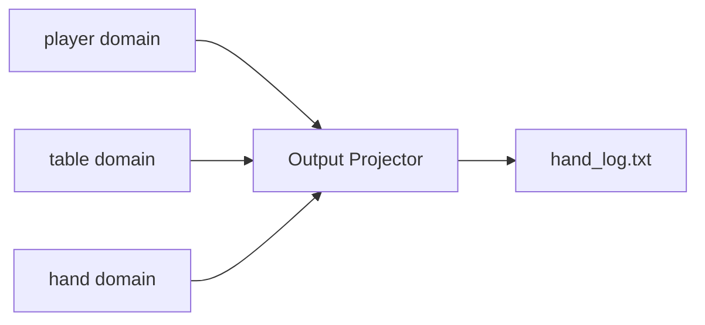

import { Tabs, TabItem } from '@astrojs/starlight/components';


Read-side projectors from the poker domain. All code is from the actual [examples/](https://github.com/benjaminabbitt/angzarr/tree/main/examples) directory.

Projectors subscribe to events and produce read-optimized views: text logs, database tables, search indexes, or external API calls.

---

## Output Projector

The **Output Projector** subscribes to events from multiple domains (player, table, hand) and writes formatted game logs to a file. This demonstrates a **multi-domain projector**.

**[`examples/cpp/prj-output/src/main.cpp`](https://github.com/benjaminabbitt/angzarr/blob/main/examples/cpp/prj-output/src/main.cpp)**

Projectors are classes with `@projects` / `[Projects]` decorators on event-handling methods — the same OO pattern as aggregates and sagas. All six languages use this.

---

## Multi-Domain Subscription

Projectors can subscribe to events from multiple domains. The `Output` projector subscribes to **player**, **table**, and **hand** domains:



Each language's `ProjectorHandler`/`ProjectorBase` accepts multiple domain names:

<Tabs>
<TabItem label="Python">

```python
handler = ProjectorHandler("output", "player", "table", "hand")
```

</TabItem>
</Tabs>

---

## Projector Principles

1. **Read-only** — Projectors never modify domain state, only create read views
2. **Idempotent** — Same events always produce same projections
3. **Catchup safe** — Can replay full event history to rebuild state
4. **Domain aware** — Subscribe to specific domains, filter unwanted events
5. **Stateful OK** — Can maintain local state (caches, maps) for rendering

---

## Running Projectors

### With ProjectorHandler (All Languages)

```bash
# Python
cd examples/python && python -m prj-output.main

# Go
cd examples/go && go run ./prj-output

# Rust
cd examples/rust && cargo run --bin prj-output

# Java
cd examples/java && ./gradlew prj-output:run

# C#
cd examples/csharp && dotnet run --project Prj/Output

# C++
cd examples/cpp && ./build/prj-output
```

---

## Next Steps

- **[Aggregates](/examples/aggregates)** — Command handling examples
- **[Sagas](/examples/sagas)** — Cross-domain coordination
- **[CloudEvents](/components/cloudevents)** — External event publishing
