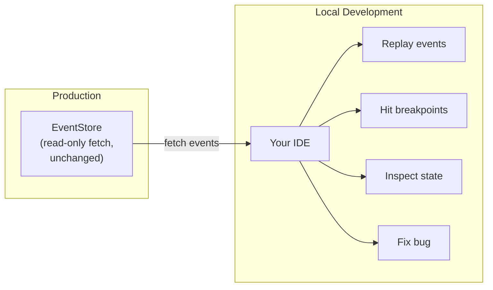

import { Tabs, TabItem } from '@astrojs/starlight/components';


Bug report: "Player's bet was accepted but their chips didn't decrease." You need to debug it. Traditional approach: set up a dev database, seed it with approximate data, try to recreate the conditions. Hope you got close enough.

Event sourcing approach: fetch the exact events, replay them through your code. Debug the *actual* failure.

---

## The Problem with Traditional Debugging

Debugging production issues typically requires:

1. **Database setup** — Provision a dev database, configure connections
2. **Data seeding** — Create test data that approximates production state
3. **State recreation** — Manually construct the scenario that triggered the bug
4. **Guesswork** — Hope your approximation matches what actually happened

You're debugging a simulation of the problem, not the problem itself.

---

## Event Sourcing Changes Everything

In event-sourced systems, **the event history IS the state**. To debug any aggregate:

1. Fetch its events from production
2. Replay them through your code
3. Debug the exact sequence that failed

No database setup. No seed data. No guesswork.



---

## Editions + Speculative Execution

Two features combine to make this safe and repeatable:

| Feature | Purpose |
|---------|---------|
| **[Editions](./editions)** | Isolate debugging sessions from production |
| **[Speculative Execution](../sdks/speculative)** | Run commands without persistence |

Together they let you replay production scenarios locally, modify code, and re-run—as many times as needed—without side effects.

---

## The Workflow

### 1. Capture the Failure Context

When an error occurs, capture the aggregate root and sequence:

```python title="illustrative - error context capture"
# Error handler captures context
try:
    result = client.execute(command)
except CommandRejectedError as e:
    logger.error(
        "Command failed",
        aggregate_root=command.cover.root.value,
        domain=command.cover.domain,
        sequence=e.sequence,
        error=str(e),
    )
```

### 2. Fetch Production Events

Pull the event history that led to the failure:

<Tabs>
<TabItem label="Python">

```python
from angzarr_client import QueryClient

# Connect to production (read-only)
client = QueryClient.connect(PRODUCTION_ENDPOINT)

# Fetch the exact event history
query = EventQuery(
    cover=Cover(domain="player", root=Uuid(value=aggregate_root)),
)
event_book = client.get_event_book(query)

print(f"Fetched {len(event_book.pages)} events")
for page in event_book.pages:
    print(f"  [{page.sequence}] {page.event.type_url}")
```

</TabItem>
</Tabs>

### 3. Replay Locally with Speculative Execution

Run the failing command against the fetched state—locally, with your debugger attached:

<Tabs>
<TabItem label="Python">

```python
from angzarr_client import SpeculativeClient
from angzarr_client.proto.angzarr import SpeculateAggregateRequest, Edition

# Connect to LOCAL coordinator (your dev environment)
client = SpeculativeClient.connect("localhost:1310")

# Create a debug edition (isolates from everything)
edition = Edition(name=f"debug-{issue_id}-{datetime.now().isoformat()}")

# Replay the exact production events + failing command
request = SpeculateAggregateRequest(
    command=failing_command,
    events=event_book.pages,  # Production events
    edition=edition,
)

# SET YOUR BREAKPOINTS HERE
# Step through the @handles method and any @applies reducers
response = client.aggregate(request)

# Inspect what happened
if response.error:
    print(f"Reproduced error: {response.error}")
else:
    print("Command succeeded - bug may be environment-specific")
    for page in response.events.pages:
        print(f"  Would emit: {page.event.type_url}")
```

</TabItem>
</Tabs>

### 4. Iterate Until Fixed

The beauty: **nothing persists**. You can:

1. Set breakpoints in your handler code
2. Step through the `@handles` method and any `@applies` reducers it depends on
3. Identify the bug
4. Modify your code
5. Re-run the same replay
6. Verify the fix
7. Repeat as needed

No database resets. No re-seeding. No cleanup.

---

## Debugging Sagas

Same pattern works for saga issues. Fetch events from the source domain, replay through your saga logic:

```python title="illustrative - saga debugging"
# Fetch events that triggered the saga
source_events = query_client.get_event_book(source_query)

# Fetch destination state the saga would have seen
dest_events = query_client.get_event_book(dest_query)

# Replay through saga
request = SpeculateSagaRequest(
    events=source_events.pages,
    destination=dest_events,
    edition=debug_edition,
)

# Debug your saga logic
response = client.saga(request)

for cmd in response.commands:
    print(f"Saga would emit: {cmd.cover.domain}/{cmd}")
```

---

## Debugging Process Managers

For stateful process managers, fetch both the PM's own event stream and the domain events it received:

```python title="illustrative - PM debugging"
# Fetch PM's state (its own events keyed by correlation_id)
pm_events = query_client.get_event_book(
    EventQuery(cover=Cover(domain="pm-hand-flow", root=correlation_id))
)

# Fetch domain events the PM received
domain_events = query_client.get_event_book(domain_query)

# Replay through PM
request = SpeculatePMRequest(
    pm_events=pm_events.pages,
    domain_events=domain_events.pages,
    edition=debug_edition,
)

response = client.process_manager(request)
```

---

## Cross-Domain Debugging

For bugs that span multiple domains, replay the entire flow:

```python title="illustrative - cross-domain debugging"
# 1. Fetch Player aggregate events
player_events = query_client.get_event_book(player_query)

# 2. Fetch Table aggregate events
table_events = query_client.get_event_book(table_query)

# 3. Replay Player command
player_result = speculative_client.aggregate(
    SpeculateAggregateRequest(
        command=reserve_funds_cmd,
        events=player_events.pages,
    )
)

# 4. Replay saga translation
saga_result = speculative_client.saga(
    SpeculateSagaRequest(
        events=player_result.events.pages,  # FundsReserved
        destination=table_events,
    )
)

# 5. Replay Table command (from saga)
table_result = speculative_client.aggregate(
    SpeculateAggregateRequest(
        command=saga_result.commands[0],
        events=table_events.pages,
    )
)

# Now you can see exactly where the cross-domain flow broke
```

---

## Why This Works

Event sourcing properties that enable this:

| Property | Debugging Benefit |
|----------|-------------------|
| **Immutability** | Events never change—same input, same replay |
| **Complete history** | Every state transition is recorded |
| **Determinism** | Same events + same command = same result |
| **Isolation** | Editions and speculation prevent side effects |

Your production event store becomes a **library of reproducible test cases**.

---

## Best Practices

### Capture Context on Errors

Log enough to fetch the event history later:

```python title="illustrative - error handler logging"
@error_handler
def on_command_rejected(error, command, context):
    logger.error(
        "command_rejected",
        domain=command.cover.domain,
        root=command.cover.root.value.hex(),
        sequence=context.sequence,
        correlation_id=context.correlation_id,
        error_code=error.code,
        error_message=str(error),
    )
```

### Use Unique Edition Names

Include issue IDs and timestamps to avoid collisions:

```python title="illustrative - unique edition naming"
edition = Edition(name=f"debug-{jira_ticket}-{developer}-{timestamp}")
```

### Clean Up Editions

If you persist speculative results during debugging, clean up afterward:

```python title="illustrative - edition cleanup"
# After debugging session
delete_edition_events(domain="player", edition=edition.name)
delete_edition_events(domain="table", edition=edition.name)
```

### Script Common Debug Scenarios

Create helper scripts for your team:

```python title="illustrative - debug helper script"
# scripts/debug_player_command.py
def debug_player_issue(aggregate_root: str, command: CommandBook):
    """Replay a player aggregate issue locally."""
    events = fetch_production_events("player", aggregate_root)
    result = speculative_replay(command, events)
    print_debug_report(result)
```

---

## See Also

- **[Editions](./editions)** — Temporal branching for isolation
- **[Speculative Execution](../sdks/speculative)** — Commands without persistence
- **[Testing Strategy](/operations/testing)** — Unit-testing `@handles` methods directly
- **[Error Handling](../sdks/error-handling)** — Capturing error context
