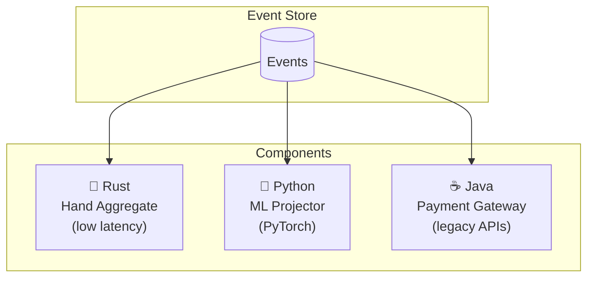

import { Tabs, TabItem } from '@astrojs/starlight/components';


Your Python team writes the ML projector. Your Rust team writes the latency-critical aggregate. Your Java team maintains the legacy integration. Same events. Same behavior.

---

## The Promise

Six languages. One event stream. Identical behavior verified by the same test suite.

| Language | Client Library | Typical Use |
|----------|----------------|-------------|
| Python | `angzarr-client` | ML projectors, analytics, scripting |
| Rust | `angzarr-client` | High-performance aggregates |
| Go | `github.com/angzarr/client` | Microservices, infrastructure |
| Java | `dev.angzarr:client` | Enterprise integrations |
| C# | `Angzarr.Client` | .NET ecosystems |
| C++ | header-only | Embedded, performance-critical |

Any language with gRPC support works. These six have thin client libraries that reduce boilerplate.

---

## Proto as Contract

The magic is [Protocol Buffers](https://protobuf.dev/). Your data model—commands, events, state—lives in `.proto` files:

```protobuf title="illustrative - shared proto contract"
// Shared across all languages
message PlayerActed {
  string hand_id = 1;
  string player_id = 2;
  ActionType action = 3;
  int64 amount = 4;
}

enum ActionType {
  FOLD = 0;
  CHECK = 1;
  CALL = 2;
  RAISE = 3;
  ALL_IN = 4;
}
```

Generate bindings for each language. The types are the contract.

The architecture could use alternative serialization and RPC technologies, but Protocol Buffers and gRPC are fast, well-supported across languages, and already in use in enterprises today.

---

## Same Behavior, Verified

All six implementations share the same Gherkin specifications:

```gherkin title="illustrative - shared Gherkin spec"
# examples/features/player.feature
Scenario: Player deposits funds
  Given a registered player with $100 balance
  When they deposit $50
  Then their balance is $150
  And a FundsDeposited event is recorded
```

Each language runs these scenarios against its implementation. If the tests pass, behavior is identical.

---

## Example: Poker Platform



- **Rust**: Hand aggregate handles player actions during live play. Maintainability and security with high performance.
- **Python**: ML projector consumes events for model training and real-time predictions. PyTorch integration is natural.
- **Java**: Payment gateway integration speaks to legacy banking APIs. The team already knows the ecosystem.

Each component:
- Receives the same events
- Uses the same proto types
- Deploys independently
- Tests against shared Gherkin specs

---

## Gradual Migration

Start with one language. Add others as needed.

```text title="illustrative - gradual migration timeline"
Month 1: Python prototype
         └── Prove the architecture

Month 3: Rust for hot path
         └── Performance requirements emerge

Month 6: Java for banking integration
         └── Existing team, existing code

Month 12: All three in production
          └── Each optimized for its role
```

No big bang. No coordinated rewrites. Components evolve at their own pace.

---

## Team Autonomy

Different teams, different strengths:

| Team | Expertise | Responsibility |
|------|-----------|----------------|
| Core platform | Rust | Hand/table aggregates |
| Data science | Python | ML projectors, analytics |
| Integrations | Java | Payment, KYC, legacy APIs |
| Mobile API | Go | Edge services, caching |

Teams choose their tools. The event stream is the integration point.

---

## Client Library Comparison

Each library follows the same patterns:

<Tabs>
<TabItem label="Python">

```python title="examples/python/player/agg/handlers.py"
@command_handler(player.DepositFunds)
def handle_deposit(
    cmd: player.DepositFunds, state: PlayerState, seq: int
) -> player.FundsDeposited:
    """Deposit funds into player's bankroll."""
    if not state.exists:
        raise CommandRejectedError("Player does not exist")

    amount = cmd.amount.amount if cmd.amount else 0
    if amount <= 0:
        raise CommandRejectedError("amount must be positive")

    new_balance = state.bankroll + amount
    return player.FundsDeposited(
        amount=cmd.amount,
        new_balance=poker_types.Currency(amount=new_balance, currency_code="CHIPS"),
        deposited_at=now(),
    )
```

</TabItem>
</Tabs>

Same pattern. Same semantics. Different syntax.

Handler function/class names match the proto command type exactly — `handle_deposit_funds` / `HandleDepositFunds` / `DepositFundsHandler`. The same convention applies to `RegisterPlayer` and `TransferFunds`, which are also implemented in all six languages.

---

## The Framework Doesn't Care

Behind the gRPC endpoint, Angzarr sees:
- A proto request
- A proto response

Whether your handler is Python, Rust, Java, or anything else—the framework doesn't know or care. It sends commands, receives events, manages persistence.

Your code is a black box that speaks proto.

---

## See Also

- [SDKs](../sdks) — Language-specific documentation
- [Small footprint](./small-footprint) — Why handlers stay simple
- [Getting started](../getting-started) — Pick a language and begin
