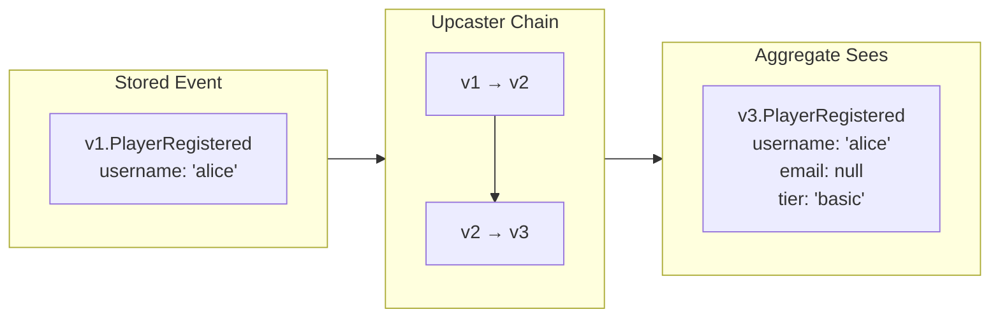

import { Tabs, TabItem } from '@astrojs/starlight/components';


Your event from 2019 still works in 2025. No migration scripts. No downtime.

---

## The Problem

Events are immutable. Once persisted, they cannot change. But schemas evolve: fields are added, types change, structures are reorganized.

Traditional migrations modify data in place—possible for current state, impossible for immutable history.

---

## The Solution: Transform at Read Time

Upcasters transform old events into new shapes when they're read, not when they're stored:



The original bytes remain untouched. The audit trail is immutable. But your aggregates always see the current schema.

---

## How It Works

Register upcasters that transform events from one type to the next:

```python title="illustrative - upcaster chain"
from myapp.proto import v1, v2, v3  # generated per-version proto packages

class PlayerUpcaster(Upcaster):
    name = "upcaster-player"
    domain = "player"

    @upcasts(v1.PlayerRegistered, v2.PlayerRegistered)
    def v1_to_v2(self, old: v1.PlayerRegistered) -> v2.PlayerRegistered:
        # v2 added email field
        return v2.PlayerRegistered(
            username=old.username,
            email=None,
        )

    @upcasts(v2.PlayerRegistered, v3.PlayerRegistered)
    def v2_to_v3(self, old: v2.PlayerRegistered) -> v3.PlayerRegistered:
        # v3 (current) added tier field
        return v3.PlayerRegistered(
            username=old.username,
            email=old.email,
            tier="basic",
        )
```

Version is part of the proto package path (`myapp.v1.PlayerRegistered`, `myapp.v2.PlayerRegistered`, …). The framework chains transformations: a `v1.PlayerRegistered` event transforms to `v2.PlayerRegistered`, then to `v3.PlayerRegistered`, arriving at your aggregate in the latest shape.

---

## Version Detection

The upcaster matches events by type URL suffix. Two common patterns:

### Package Versioning (Recommended)

Keep version in the proto package, not the type name. Cleaner organization, easier tooling:

```protobuf title="illustrative - package versioning"
// proto/myapp/v1/player.proto
package myapp.v1;
message PlayerRegistered { ... }

// proto/myapp/v2/player.proto
package myapp.v2;
message PlayerRegistered { ... }

// proto/myapp/v3/player.proto (current)
package myapp.v3;
message PlayerRegistered { ... }
```

Type URLs: `myapp.v1.PlayerRegistered` → `myapp.v2.PlayerRegistered` → `myapp.v3.PlayerRegistered`

### Type Name Suffixes

Simpler for small schemas, but clutters the namespace and mixes with `.v*` imports awkwardly:

```protobuf title="illustrative - type name suffixes"
message PlayerRegisteredV1 { ... }
message PlayerRegisteredV2 { ... }
message PlayerRegisteredV3 { ... }  // current
```

Prefer package versioning. The examples below use the recommended `v1.PlayerRegistered` form.

---

## Examples Across Languages

<Tabs>
<TabItem label="Python">

```python
from myapp.proto import v1, v2

class PlayerUpcaster(Upcaster):
    name = "upcaster-player"
    domain = "player"

    @upcasts(v1.FundsDeposited, v2.FundsDeposited)
    def upcast_deposit(self, old: v1.FundsDeposited) -> v2.FundsDeposited:
        # v1 had raw int, v2 wraps it in Currency
        return v2.FundsDeposited(
            amount=Currency(amount=old.amount, currency_code="USD"),
        )
```

</TabItem>
</Tabs>

---

## Guidelines

### Keep Upcasters Pure

Upcasters should be pure functions: same input, same output. No database lookups, no external calls.

```python title="illustrative - pure vs impure upcasters"
# Good: pure transformation
def upcast(event):
    event["new_field"] = derive_from_existing(event["old_field"])
    return event

# Bad: external dependency
def upcast(event):
    event["user_name"] = db.lookup_user(event["user_id"])  # Don't do this
    return event
```

### Chain, Don't Skip

Always upcast to the next version, not directly to latest:

```python title="illustrative - chained vs skipped versions"
# Good: v1 → v2 → v3
@upcasts(v1.OrderCreated, v2.OrderCreated)
def v1_to_v2(self, old): ...

@upcasts(v2.OrderCreated, v3.OrderCreated)
def v2_to_v3(self, old): ...

# Bad: skip versions
@upcasts(v1.OrderCreated, v3.OrderCreated)
def v1_to_v3(self, old): ...  # What about v2 events?
```

### Test with Real History

Your test suite should include events from every historical version:

```python title="illustrative - upcast chain test"
def test_upcast_chain():
    event = load_fixture("v1.PlayerRegistered.json")   # captured from prod history
    result = upcast_chain(event)  # v1 → v2 → v3

    assert isinstance(result, v3.PlayerRegistered)
    assert result.email is None
    assert result.tier == "basic"
```

---

## Deployment

Upcasters deploy with your application code. When you release a new version:

1. Add upcaster for old → new transformation
2. Deploy new code
3. Old events transform on read
4. New events persist in new format

No migration window. No downtime. Old and new events coexist seamlessly.

---

## See Also

- [SDK: Upcasters](../sdks) — Language-specific implementation details
- [Performance](./performance) — Snapshots reduce upcasting overhead
