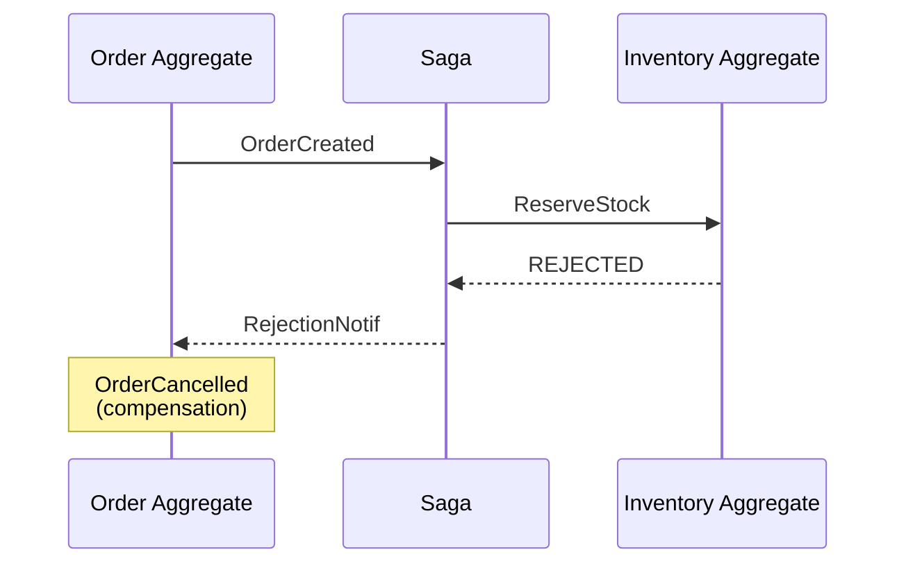

# Compensation

The process of handling failures in distributed workflows by emitting events that undo or mitigate effects of prior events.

## When Compensation Occurs

1. Saga issues command to target aggregate
2. Target aggregate rejects the command
3. [RejectionNotification](/glossary/notification) sent to originating saga
4. Saga's source aggregate receives notification
5. Source aggregate emits compensation events

## Flow Diagram

## SagaCommandOrigin

Tracks information needed for compensation routing:
- Saga name
- Triggering aggregate (domain, root)
- Triggering event sequence

## Revocation

Response from compensation handlers indicating how to proceed:
- Continue with compensation
- Abort compensation flow
- Escalate to DLQ
