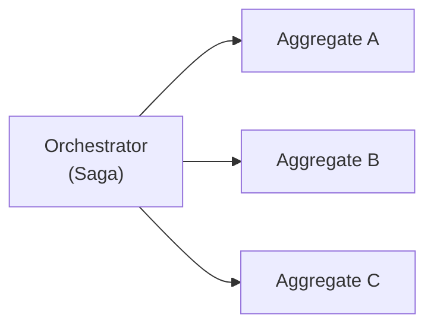
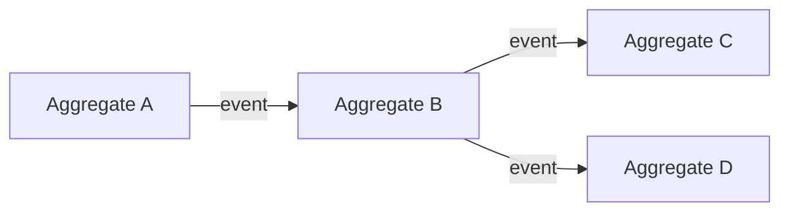

# Orchestration vs Choreography

Two fundamental patterns for coordinating distributed workflows.

## Orchestration

A central coordinator (saga/PM) explicitly controls the workflow:

**Characteristics:**
- Central control point
- Explicit workflow definition
- Easier to understand/debug
- Single point of failure

**In Angzarr:** [Sagas](/glossary/saga) and [Process Managers](/glossary/process-manager) implement orchestration.

## Choreography

Components react independently to events:

**Characteristics:**
- Decentralized control
- Loose coupling
- Harder to trace workflows
- More resilient

**In Angzarr:** Multiple sagas can create choreographed behavior by each reacting to different events.

## When to Use Each

| Scenario | Pattern |
|----------|---------|
| Complex multi-step workflow | Orchestration (PM) |
| Simple domain translation | Orchestration (Saga) |
| Independent reactions | Choreography |
| Need central monitoring | Orchestration |
| Maximum decoupling | Choreography |

## Hybrid Approach

Angzarr supports combining both:
- Sagas for explicit domain translation
- Multiple sagas reacting to same events (choreography)
- Process managers for complex orchestration
