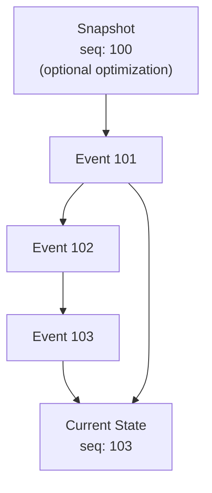

# Replay

Reconstruct current aggregate state by applying all events from sequence 0 (or from a [snapshot](/glossary/snapshot)).

## How It Works

## When Replay Happens

1. **Aggregate load:** Before processing a command
2. **Projector startup:** Catching up on missed events
3. **Debugging:** Understanding how state evolved
4. **Recovery:** Rebuilding state after data loss

## Replay vs Temporal Query

| Aspect | Replay | Temporal Query |
|--------|--------|----------------|
| Target | Current state | Historical state |
| Events used | All (or from snapshot) | Up to timestamp/sequence |
| Use case | Normal operation | Audit, debugging |

## Optimization

[Snapshots](/glossary/snapshot) avoid replaying all events by caching state at checkpoints.
