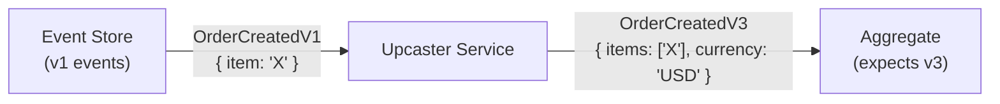
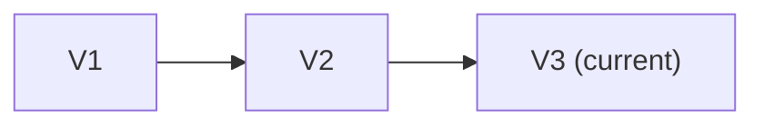

# Upcasting

Transform old event versions to the current version at read time. Upcasting enables gradual schema migration without rewriting historical events.

## How It Works



## When to Use

- Adding required fields with defaults
- Renaming fields
- Restructuring nested objects
- Splitting/merging event types

## Upcaster Chain

Events may go through multiple transformations:



Each upcaster handles one version transition.

## In Angzarr

The `UpcasterService` gRPC service handles version transformation:

```protobuf
service UpcasterService {
  rpc Upcast(UpcasterRequest) returns (UpcasterResponse);
}
```

## Alternative: Event Versioning

Instead of upcasting, you can:
- Store multiple event versions
- Have aggregates handle multiple versions

Upcasting is preferred for cleaner aggregate code.
