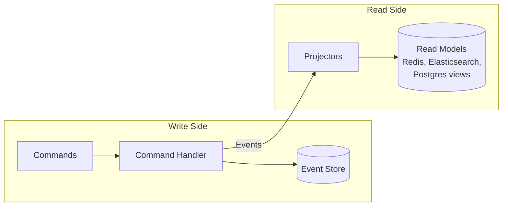
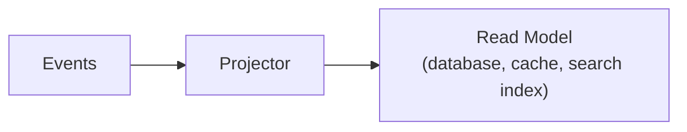
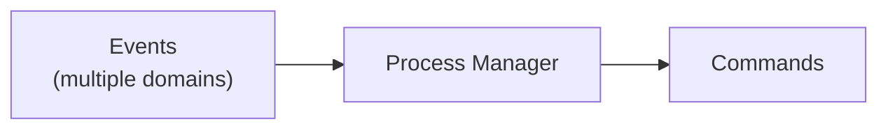

This page explains the technical patterns underlying event-sourced systems. If you haven't read [Why Event Sourcing?](/), start there to understand the business motivation.

---

## Event Sourcing

Traditional systems store current state. Event sourcing stores the sequence of changes that produced it.

### Traditional State Storage

*`players` table:*

| Column | Value |
|--------|-------|
| `id` | `"player-123"` |
| `username` | `"Alice"` |
| `bankroll` | `1500` |
| `updated_at` | `2024-01-15 10:30:00` |

Problem: We only know current state.
- When did Alice register?
- How did she accumulate 1500?
- What was her bankroll before the last change?

### Event Sourced Storage

*`events` table:*

| seq | type | data |
|-----|------|------|
| 0 | `PlayerRegistered` | `{username: "Alice", ...}` |
| 1 | `FundsDeposited` | `{amount: 1000, ...}` |
| 2 | `FundsReserved` | `{amount: 500, ...}` |
| 3 | `FundsReleased` | `{amount: 500, ...}` |
| 4 | `FundsDeposited` | `{amount: 500, ...}` |

Current state: replay events 0-4 → bankroll = 1000 - 500 + 500 + 500 = 1500

Benefits:
- Complete audit trail
- Time travel (state at any point)
- Debug by replaying
- Never lose information

### State Reconstruction

Current state is derived by replaying events:

```python
def rebuild_state(events):
    state = empty_state()
    for event in events:
        state = apply(state, event)
    return state
```

With snapshots (optimization for long event streams):

```python
def rebuild_state(events, snapshot):
    if snapshot:
        state = snapshot.state
        events = events[snapshot.sequence + 1:]
    else:
        state = empty_state()

    for event in events:
        state = apply(state, event)
    return state
```

### Immutability

Events are immutable facts. Once recorded, they cannot be changed or deleted. This is what makes the audit trail trustworthy—you can't rewrite history.

If you need to "undo" something, you emit a compensating event (e.g., `FundsRefunded` rather than deleting `FundsCharged`).

---

## CQRS

**Command Query Responsibility Segregation** separates the write model (commands/events) from read models (projections).



### Why Separate?

- **Write model** optimized for consistency (validate business rules, sequence events)
- **Read models** optimized for specific query patterns (dashboards, search, reports)
- **Scale independently**—read-heavy workloads don't compete with writes
- **Each projection can use the best storage** for its purpose (Elasticsearch for search, Redis for real-time, Postgres for reports)

### The Trade-off

Read models are **eventually consistent**. After a write, projections update asynchronously. For most domains, this latency (milliseconds to seconds) is acceptable. For domains requiring immediate consistency, additional patterns are needed.

---

## A Candid Word on CQRS Complexity

Martin Fowler's [CQRS](https://martinfowler.com/bliki/CQRS.html) is the canonical reference for this pattern. Read it first. His warnings are pointed and worth reproducing verbatim:

> "For some situations, this separation can be valuable, but beware that for most systems CQRS adds risky complexity."
>
> — Martin Fowler, [CQRS](https://martinfowler.com/bliki/CQRS.html) <sup>[1](#ref-fowler-cqrs)</sup>

> "While I have come across successful uses of CQRS, so far the majority of cases I've run into have not been so good, with CQRS seen as a significant force for getting a software system into serious difficulties."
>
> — Martin Fowler, [CQRS](https://martinfowler.com/bliki/CQRS.html) <sup>[1](#ref-fowler-cqrs)</sup>

> "you should be very cautious about using CQRS. Many information systems fit well with the notion of an information base that is updated in the same way that it's read, adding CQRS to such a system can add significant complexity."
>
> — Martin Fowler, [CQRS](https://martinfowler.com/bliki/CQRS.html) <sup>[1](#ref-fowler-cqrs)</sup>

> "I've certainly seen cases where it's made a significant drag on productivity, adding an unwarranted amount of risk to the project, even in the hands of a capable team."
>
> — Martin Fowler, [CQRS](https://martinfowler.com/bliki/CQRS.html) <sup>[1](#ref-fowler-cqrs)</sup>

And on scope:

> "In particular CQRS should only be used on specific portions of a system (a BoundedContext in DDD lingo) and not the system as a whole."
>
> — Martin Fowler, [CQRS](https://martinfowler.com/bliki/CQRS.html) <sup>[1](#ref-fowler-cqrs)</sup>

Fowler does not enumerate specific failure modes in that article. The following is **our characterization** of why CQRS projects tend to fail, based on common patterns we've observed in the wild — it is not a claim about what Fowler wrote:

- **Hand-rolled plumbing.** Teams build their own event store, their own coordinator, their own projection runner. Each piece is a source of bugs. Months disappear into infrastructure before any domain logic ships.
- **Model drift.** The write model and the read models evolve separately. Schemas go out of sync. Nobody remembers which projector owns which read view.
- **Consistency confusion.** "Eventually consistent" becomes "sometimes never consistent" because retry, idempotency, and ordering get solved a little bit, by different people, at different times.
- **Ceremony overhead.** Every change ripples through commands, events, handlers, projections, and UI — with no tooling to keep them coherent.

### CQRS-ES Still Isn't For Every Project

Even with good tooling, CQRS + Event Sourcing is the wrong choice for many systems. Greg Young — who coined the term CQRS <sup>[2](#ref-young-cqrs-docs)</sup> and is the most cited source on event-sourced CQRS — has been explicit about this in his own writing and talks <sup>[3](#ref-young-dddcqrses)</sup>. Fowler's scope advice above points the same direction: this is a pattern for *some* bounded contexts, not a system-wide architecture.

If your domain is fundamentally a CRUD application over a shared data store — users, products, invoices, with no hard consistency-versus-availability trade-offs and no audit or temporal-query requirements — a traditional request/response stack is simpler, cheaper, and more than sufficient. Don't reach for this pattern because it sounds sophisticated.

And even when the domain *is* a fit, **CQRS-ES requires a mental shift** that takes a team time to internalize. The following are the shifts in thinking we see teams having to make; they are our framing, informed by Young's and Vaughn Vernon's writing on event-sourced DDD <sup>[3](#ref-young-dddcqrses), [4](#ref-vernon-iddd)</sup>, not direct quotes:

- State is derived, not stored.
- The past is immutable; compensation replaces correction.
- Read models are deliberately stale, and that's a feature.
- Cross-aggregate coordination is asynchronous, and that's also a feature.

No framework removes the need to think in these terms. If a team is unwilling to make that shift, no amount of tooling will save the project.

### Where Angzarr Fits In

Angzarr's ambition is narrower and, we think, honest: **we cannot make CQRS-ES the right choice for a wrong-fit domain, and we cannot shortcut the conceptual shift. We can make the *implementation* easy.** Much of the "significant complexity" and "drag on productivity" Fowler describes comes from plumbing the framework handles for you:

| Recurring CQRS-ES pain point | Angzarr's design response |
|---|---|
| Hand-rolled event store, coordinator, projection runner (our observation) | Framework ships all of it — aggregates, sagas, projectors, process managers, snapshots, DLQ, replay, upcasters — tested across six language SDKs. |
| Model drift between write and read sides (our observation) | One proto source of truth; generated types everywhere; [upcasters](/features/upcasting) for schema evolution. |
| Consistency, retry, and idempotency solved piecemeal (our observation) | Coordinator owns sequencing, optimistic concurrency, idempotency keys on external facts, cascade 2PC, dead-letter capture. |
| Ceremony overhead for every change (our observation) | `@handles` / `@applies` on a single class; no routers to compose; Gherkin specs drive all six language implementations identically. |
| "significant drag on productivity … even in the hands of a capable team" (Fowler) <sup>[1](#ref-fowler-cqrs)</sup> | You write domain logic. Framework owns everything else. The [small-footprint principle](/features/small-footprint) is the explicit design goal. |

If the domain fits and the team is willing to think in events, Angzarr's job is to ensure the *code* doesn't become the obstacle. That's it.

#### References

1. <a id="ref-fowler-cqrs"></a>Fowler, Martin. [CQRS](https://martinfowler.com/bliki/CQRS.html). martinfowler.com (bliki), last updated 14 July 2011.
2. <a id="ref-young-cqrs-docs"></a>Young, Greg. [CQRS Documents by Greg Young (PDF)](https://cqrs.files.wordpress.com/2010/11/cqrs_documents.pdf), 2010.
3. <a id="ref-young-dddcqrses"></a>Young, Greg. [A Decade of DDD, CQRS, Event Sourcing](https://www.youtube.com/watch?v=LDW0QWie21s), DDD Europe talk (2016).
4. <a id="ref-vernon-iddd"></a>Vernon, Vaughn. *Implementing Domain-Driven Design*. Addison-Wesley, 2013 — chapters on Aggregates, Events, and Bounded Contexts.

---

## The Components

Event-sourced systems decompose into specialized components. Each has a single responsibility.

### Aggregates

The **command handler**. Receives commands, validates them against current state (rebuilt from events), and emits new events.


- Contains business logic and validation rules
- Enforces invariants (e.g., "can't withdraw more than available balance")
- May query external systems (APIs, projections, legacy systems) for decision-making
- Should never write to external systems—leave that to projectors
- Emits events as immutable facts
- One aggregate type per bounded context

[Learn more →](/components/aggregate)

### Projectors

The **read model builder**. Subscribes to events and maintains query-optimized views.



- No business logic—just data transformation
- Can be rebuilt by replaying events
- Each projector serves a specific query need
- Can output to any storage (SQL, Redis, Elasticsearch, files)

[Learn more →](/components/projector)

### Sagas

The **domain translator**. Subscribes to events from one domain and emits commands to another.


- Bridges bounded contexts
- Stateless—each event processed independently
- Handles cross-domain workflows (order completed → start fulfillment)
- Contains minimal logic—just field mapping

[Learn more →](/components/saga)

### Process Managers

The **stateful orchestrator**. Tracks long-running workflows across multiple domains.



- Maintains workflow state via correlation ID
- Handles complex multi-step processes
- Can implement compensation (rollback) logic
- Used sparingly—adds complexity

[Learn more →](/components/process-manager)

---

## Quick Reference

| Term | Definition |
|------|------------|
| **Event** | Immutable fact that something happened. Past tense: `OrderCreated`, `FundsDeposited`. |
| **Command** | Request to change state. Imperative: `CreateOrder`, `DepositFunds`. May be rejected. |
| **Aggregate** | Cluster of domain objects treated as a unit. Enforces business rules. |
| **Aggregate Root** | Entry point entity. All external references go through the root. Identified by ID. |
| **Event Store** | Append-only database of events. The source of truth. |
| **Projection** | Read-optimized view derived from events. Eventually consistent. |
| **Projector** | Component that builds projections from event streams. |
| **Saga** | Stateless service bridging events in one domain to commands in another. |
| **Process Manager** | Stateful workflow coordinator across multiple domains. |
| **Snapshot** | Cached aggregate state for replay optimization. |
| **Correlation ID** | Identifier linking related events across domains. |

[Full Glossary →](./glossary)

---

## Learning Resources

### Visual Guides

- [EDA Visuals](https://eda-visuals.boyney.io/) by [@boyney123](https://twitter.com/boyney123) — Bite-sized diagrams explaining EDA concepts ([PDF](https://eda-visuals.boyney.io/visuals/eda-visuals.pdf))
  - [What is Event Sourcing?](https://eda-visuals.boyney.io/visuals/what-is-eventsourcing)
  - [Commands vs Events](https://eda-visuals.boyney.io/visuals/commands-vs-events)
  - [Understanding Eventual Consistency](https://eda-visuals.boyney.io/visuals/eventual-consistency)
  - [Understanding Idempotency](https://eda-visuals.boyney.io/visuals/understanding-idempotency)

### Talks

- [CQRS and Event Sourcing](https://www.youtube.com/watch?v=JHGkaShoyNs) — Greg Young's foundational talk (2014)
- [Event Sourcing You are doing it wrong](https://www.youtube.com/watch?v=GzrZworHpIk) — David Schmitz on common pitfalls (2018)
- [A Decade of DDD, CQRS, Event Sourcing](https://www.youtube.com/watch?v=LDW0QWie21s) — Greg Young retrospective (2016)

### Articles

- [Event Sourcing pattern](https://learn.microsoft.com/en-us/azure/architecture/patterns/event-sourcing) — Microsoft Azure Architecture
- [CQRS pattern](https://learn.microsoft.com/en-us/azure/architecture/patterns/cqrs) — Microsoft Azure Architecture
- [Event Sourcing](https://martinfowler.com/eaaDev/EventSourcing.html) — Martin Fowler
- [CQRS](https://martinfowler.com/bliki/CQRS.html) — Martin Fowler

---

## Next Steps

- **[Introduction to Angzarr](./intro)** — The Angzarr framework
- **[Getting Started](./getting-started)** — Build your first event-sourced system
- **[Aggregates](/components/aggregate)** — Deep dive into command handling
