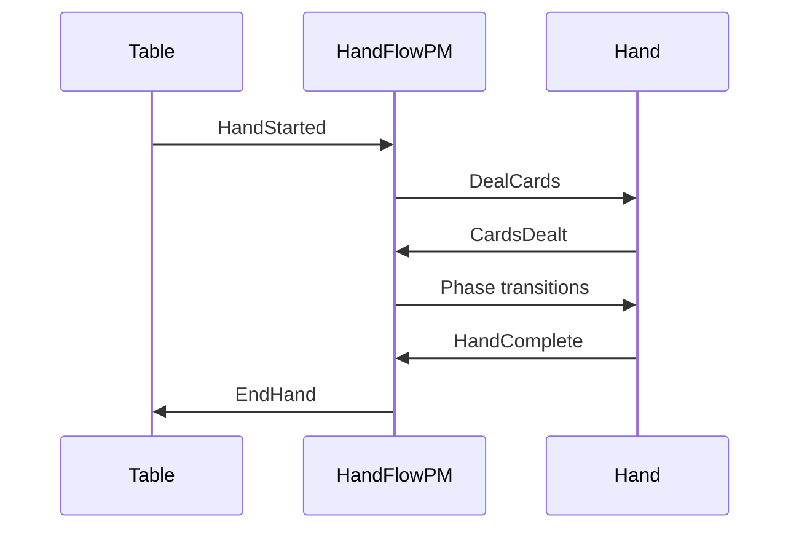

import { Tabs, TabItem } from '@astrojs/starlight/components';


A **process manager** coordinates multi-domain workflows with state tracking. Unlike stateless sagas, process managers maintain their own event stream keyed by correlation ID, enabling complex orchestration patterns.

---

## When to Use Process Managers

| Use Case | Saga | Process Manager |
|----------|------|-----------------|
| Single event → single command | ✓ | |
| Fan-out to multiple domains | ✓ | |
| Multi-step workflow with state | | ✓ |
| Events from multiple domains | | ✓ |
| State machine transitions | | ✓ |
| Timeouts and retries | | ✓ |

### Warning: Process Manager Anti-Patterns

**Over-reliance on process managers is a foot-gun.** If you find yourself:

- Putting significant business logic in a PM
- Building PMs with large, complex state
- Creating PMs for workflows within a single domain
- Reaching for PMs as a first solution

**Your domain factoring is probably wrong.**

Process managers should be **lightweight state machines** coordinating across domains—not business logic containers. They answer "what phase are we in?" and "what happens next?", not "how do we calculate X?"

| Symptom | Likely Problem |
|---------|----------------|
| PM has complex validation logic | Logic belongs in domain aggregate |
| PM state mirrors aggregate state | Redundant—query the aggregate |
| PM handles single-domain workflow | Use saga or aggregate instead |
| PM event stream grows large | Too much responsibility—split domains |

**Rule of thumb:** If a PM does more than track phases and dispatch commands, reconsider your architecture. The PM's job is orchestration, not computation.

---

## Example: Hand Flow PM

The HandFlowPM orchestrates poker hand phases across table and hand domains:



PMs extend the client library's `ProcessManager` base class; handler methods are registered by decorator / attribute / macro. State lives on the instance.

### State Definition

<Tabs>
<TabItem label="Python">

```python file=vendor/examples/python/pmg-hand-flow/hand_flow_pm.py region=pm_state
```

</TabItem>
</Tabs>

### Handler Implementation

<Tabs>
<TabItem label="Python">

```python file=vendor/examples/python/pmg-hand-flow/hand_flow_pm.py region=pm_handler
```

</TabItem>
</Tabs>

---

## Correlation ID

Process managers use the **correlation ID** as their aggregate root:

```protobuf file=proto/angzarr_client/proto/angzarr/v1/types.proto region=cover
```

All events in a workflow share the same correlation ID, allowing the PM to:
- Receive events from multiple domains
- Maintain workflow state across events
- Track progress through the state machine
- Emit **commands** or **facts** to target domains

---

## Commands vs Facts

PMs can emit either **commands** (requests that can be rejected) or **facts** (assertions the target must accept):

| Output | Can Reject | Use Case |
|--------|------------|----------|
| **Command** | Yes | Request action that may fail validation |
| **Fact** | No | Assert PM's orchestration decision |

Facts are useful when the PM has authority the target aggregate must accept—phase transitions, tournament rulings, dealer decisions:

```python title="illustrative"
# Command: request action, may be rejected
def handle_hand_complete(event: HandComplete, state: WorkflowState):
    return CommandBook(domain="player", command=TransferChips(amount=event.pot))

# Fact: assert PM decision, cannot be rejected
def handle_phase_transition(event: AllPlayersReady, state: WorkflowState):
    return FactBook(
        domain="hand",
        external_id=f"phase:{state.correlation_id}:{state.current_phase}",
        event=PhaseAdvanced(phase=state.next_phase),
    )
```

See **[Commands vs Facts](/features/facts)** for details on when to use each.

---

## State Persistence

PM state is stored as events in the PM's own event stream:

```text title="illustrative - PM event stream"
PM Event Stream (correlation_id = "hand-abc-123"):
  [0] WorkflowStarted { hand_id: "...", phase: "awaiting_deal" }
  [1] PhaseTransitioned { from: "awaiting_deal", to: "dealing" }
  [2] PhaseTransitioned { from: "dealing", to: "blinds" }
  [3] WorkflowCompleted { winner_id: "..." }
```

On restart, the PM rebuilds state by replaying its own events.

---

## Rejection Handling

When a PM-issued command is rejected, the PM receives a Notification before the source aggregate:

```text title="illustrative - rejection flow"
1. PM issues DealCards → Hand rejects (invalid_player_count)
       │
       ▼
2. PM receives Notification first
   - Can update workflow state (mark step failed)
   - Can decide to retry or abort
       │
       ▼
3. Source aggregate receives Notification
   - Emits compensation events
```

<Tabs>
<TabItem label="Python">

```python title="illustrative"
@rejected("hand", "DealCards")
def handle_deal_rejected(self, state: HandFlowState, notification: Notification):
    # Update workflow state
    return WorkflowFailed(
        hand_id=state.hand_id,
        reason=f"Deal failed: {notification.rejection_reason}",
        step="deal_cards",
    )
```

</TabItem>
</Tabs>

---

## Timeouts

:::note[Future Feature]
PM-scheduled timeouts (e.g., player action timers, turn clocks) are planned but not yet implemented.

See [Roadmap](../roadmap#process-manager-timeouts) for details.
:::

---

## PM vs Saga

| Aspect | Saga | Process Manager |
|--------|------|-----------------|
| **State** | Stateless | Stateful (own event stream) |
| **Identity** | None | correlation_id |
| **Input domains** | Single | Multiple |
| **Persistence** | No | Yes (workflow events) |
| **Timeouts** | No | Planned |
| **Complexity** | Low | Higher |

**Rule of thumb**: Start with sagas. Upgrade to PM when you need state tracking or multi-domain input.

---

## Next Steps

- **[Sagas](/components/saga)** — Simpler stateless coordination
- **[Commands vs Facts](/features/facts)** — When to emit facts instead of commands
- **[Why Poker](/examples/why-poker#5-process-manager-orchestration)** — PM patterns in poker
- **[Testing](/operations/testing)** — Testing PMs with Gherkin
