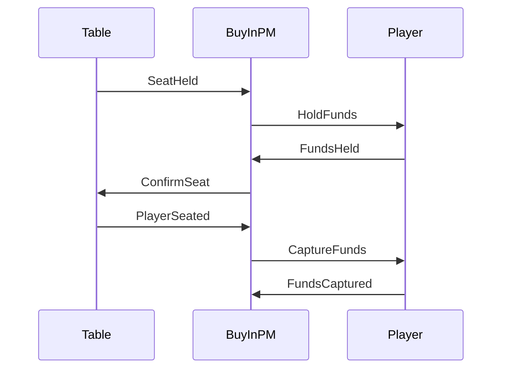

import { Tabs, TabItem } from '@astrojs/starlight/components';


A **process manager** coordinates multi-domain workflows with state tracking. Unlike stateless sagas, process managers maintain their own event stream keyed by correlation ID, enabling complex orchestration patterns.

---

## When to Use Process Managers

| Use Case | Saga | Process Manager |
|----------|------|-----------------|
| Single event → single command | ✓ | |
| Fan-out to multiple domains | ✓ | |
| Multi-step workflow with state | | ✓ |
| Events from multiple domains | | ✓ |
| State machine transitions | | ✓ |
| Timeouts and retries | | ✓ |

### Warning: Process Manager Anti-Patterns

**Over-reliance on process managers is a foot-gun.** If you find yourself:

- Putting significant business logic in a PM
- Building PMs with large, complex state
- Creating PMs for workflows within a single domain
- Reaching for PMs as a first solution

**Your domain factoring is probably wrong.**

Process managers should be **lightweight state machines** coordinating across domains—not business logic containers. They answer "what phase are we in?" and "what happens next?", not "how do we calculate X?"

| Symptom | Likely Problem |
|---------|----------------|
| PM has complex validation logic | Logic belongs in domain aggregate |
| PM state mirrors aggregate state | Redundant—query the aggregate |
| PM handles single-domain workflow | Use saga or aggregate instead |
| PM event stream grows large | Too much responsibility—split domains |

**Rule of thumb:** If a PM does more than track phases and dispatch commands, reconsider your architecture. The PM's job is orchestration, not computation.

---

## Example: Buy-In PM

The blackjack example's buy-in process manager secures a seat at the table and funds in the player's wallet, confirming or releasing each depending on the other. Each command it sends is decided (`SYNC_MODE_DECISION`) before it moves on:


```mermaid
sequenceDiagram
    participant T as Table
    participant PM as BuyInPM
    participant P as Player

    T->>PM: SeatHeld
    PM->>P: HoldFunds
    P->>PM: FundsHeld
    PM->>T: ConfirmSeat
    T->>PM: PlayerSeated
    PM->>P: CaptureFunds
    P->>PM: FundsCaptured
```

If the wallet refuses `HoldFunds`, the PM releases the seat; if the table refuses `ConfirmSeat`, it releases both the funds and the seat. A whole blackjack round, by contrast, runs inside the table aggregate: single-domain orchestration never needs a PM.

PMs extend the client library's `ProcessManager` base class; handler methods are registered by decorator / attribute / macro. State lives on the instance.

### State Definition

<Tabs>
<TabItem label="Python">

```protobuf title="proto/io/angzarr/examples/v1/buy_in.proto (excerpt)"
message BuyInState {
  option (io.angzarr.v1.component) = {
    kind: COMPONENT_KIND_PROCESS_MANAGER
    domain: "buy-in"
    output_domains: "player"
    output_domains: "table"
    name: "BuyInProcessManager"
    compensates: "io.angzarr.examples.v1.HoldFunds"
    compensates: "io.angzarr.examples.v1.ConfirmSeat"
  };
  enum Phase {
    PHASE_UNSPECIFIED = 0;
    PHASE_AWAITING_HOLD = 1;
    PHASE_AWAITING_SEAT = 2;
    PHASE_AWAITING_CAPTURE = 3;
    PHASE_COMPLETED = 4;
    PHASE_FAILED = 5;
  }
  bytes buy_in_id = 1;
  bytes player_root = 2;
  bytes table_root = 3;
  int32 seat = 4;
  int64 amount = 5;
  Phase phase = 6;
  string failure_reason = 7;
}
```

</TabItem>
</Tabs>

### Handler Implementation

<Tabs>
<TabItem label="Python">

```python title="illustrative - buy-in process manager (excerpt)"
@process_manager(name="pmg-buy-in", domain="buy-in")
class BuyInProcessManager:
    @handles(player_pb2.FundsHeld, domain="player")
    def on_funds_held(self, event: player_pb2.FundsHeld, state: BuyInState):
        # Ignore news about another buy-in, or news that arrives twice.
        if event.hold_id != state.buy_in_id or state.phase != BuyInState.PHASE_AWAITING_HOLD:
            return None
        return (
            BuyInFundsHeld(buy_in_id=state.buy_in_id),
            deferred_command(
                domain="table",
                root=state.table_root,
                command=table_pb2.ConfirmSeat(buy_in_id=state.buy_in_id),
                sync_mode=types.SYNC_MODE_DECISION,
            ),
        )

    @rejected("player", "HoldFunds")
    def on_hold_funds_rejected(self, notification, state: BuyInState):
        if state.phase != BuyInState.PHASE_AWAITING_HOLD:
            return None
        return (
            BuyInFailed(buy_in_id=state.buy_in_id, failed_in=state.phase),
            deferred_command(
                domain="table",
                root=state.table_root,
                command=table_pb2.ReleaseSeat(buy_in_id=state.buy_in_id),
                sync_mode=types.SYNC_MODE_DECISION,
            ),
        )
```

</TabItem>
</Tabs>

---

## Correlation ID

Process managers use the **correlation ID** as their aggregate root:

```protobuf file=proto/io/angzarr/v1/types.proto region=cover
```

All events in a workflow share the same correlation ID, allowing the PM to:
- Receive events from multiple domains
- Maintain workflow state across events
- Track progress through the state machine
- Emit **commands** or **facts** to target domains

---

## Commands vs Facts

PMs can emit either **commands** (requests that can be rejected) or **facts** (assertions the target must accept):

| Output | Can Reject | Use Case |
|--------|------------|----------|
| **Command** | Yes | Request action that may fail validation |
| **Fact** | No | Assert PM's orchestration decision |

Facts are useful when the PM has authority the target aggregate must accept—a decision already made elsewhere that the target can only record:

```python title="illustrative"
# Command: request action, may be rejected
def on_seat_held(event: SeatHeld, state: BuyInState):
    return CommandBook(domain="player", command=HoldFunds(hold_id=event.buy_in_id, amount=event.amount))

# Fact: assert a decision the target must record (not part of the example)
def on_buy_in_expired(event: BuyInExpired, state: BuyInState):
    return FactBook(
        domain="table",
        external_id=f"expired:{state.buy_in_id.hex()}",
        event=SeatHoldExpired(buy_in_id=state.buy_in_id),
    )
```

See **[Commands vs Facts](/features/facts)** for details on when to use each.

---

## State Persistence

PM state is stored as events in the PM's own event stream:

```text title="illustrative - PM event stream"
PM Event Stream (domain "buy-in", root derived from correlation_id):
  [0] BuyInStarted   { buy_in_id: "B1", seat: 0, amount: 500 }
  [1] BuyInFundsHeld { buy_in_id: "B1" }
  [2] BuyInSeated    { buy_in_id: "B1", stack: 500 }
  [3] BuyInCompleted { buy_in_id: "B1" }
```

On restart, the PM rebuilds state by replaying its own events.

---

## Rejection Handling

When a PM-issued command is rejected, the PM receives a Notification before the source aggregate:

```text title="illustrative - rejection flow"
1. PM issues HoldFunds → Player rejects (INSUFFICIENT_AVAILABLE_FUNDS)
       │
       ▼
2. PM receives Notification first
   - Can update workflow state (mark step failed)
   - Can decide to retry or abort
       │
       ▼
3. Source aggregate receives Notification
   - Emits compensation events
```

<Tabs>
<TabItem label="Python">

```python title="illustrative"
@rejected("player", "HoldFunds")
def on_hold_funds_rejected(self, state: BuyInState, notification: Notification):
    # Record the failure and release the seat held for this buy-in
    return BuyInFailed(
        buy_in_id=state.buy_in_id,
        failed_in=state.phase,
        reason=notification.rejection_reason,
    ), ReleaseSeat(buy_in_id=state.buy_in_id)
```

</TabItem>
</Tabs>

---

## Timeouts

:::note[Future Feature]
PM-scheduled timeouts (e.g., player action timers, turn clocks) are planned but not yet implemented.

See [Roadmap](../roadmap#process-manager-timeouts) for details.
:::

---

## PM vs Saga

| Aspect | Saga | Process Manager |
|--------|------|-----------------|
| **State** | Stateless | Stateful (own event stream) |
| **Identity** | None | correlation_id |
| **Input domains** | Single | Multiple |
| **Owned stream** | None (`domain` must be empty) | Its own workflow domain (`domain` required) |
| **Persistence** | No | Yes (workflow events) |
| **Timeouts** | No | Planned |
| **Complexity** | Low | Higher |

A component declares three separate domain roles in `ComponentOptions`: `domain` is the stream it owns, `input_domain` / `(event).domain` are the domains it subscribes to, and `output_domain(s)` are the domains it sends commands to. A process manager's own domain is always `domain`—never one of its sources or command targets.

**Rule of thumb**: Start with sagas. Upgrade to PM when you need state tracking or multi-domain input.

---

## Next Steps

- **[Sagas](/components/saga)** — Simpler stateless coordination
- **[Commands vs Facts](/features/facts)** — When to emit facts instead of commands
- **[Why Blackjack](/examples/why-blackjack#1-two-resources-two-domains-a-process-manager)** — The example's buy-in PM
- **[Testing](/operations/testing)** — Testing PMs with Gherkin
