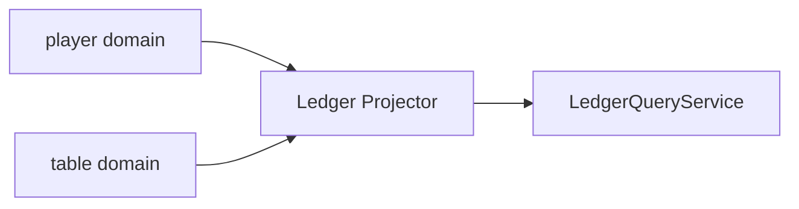

The blackjack example has one projector: the **ledger**, a read model over both the player and table domains that reports every wallet, every table's chips and the house result — and whether all the money adds up.

:::note
The blackjack implementations are being written. Until the Python one lands, this page shows the example's specification rather than projector code.
:::

---

## Multi-Domain Subscription

The ledger has no single input domain: each event it consumes names its source domain on its `(event)` entry, and the projector subscribes to the union.



```protobuf title="proto/io/angzarr/examples/v1/ledger.proto (excerpt)"
message LedgerProjection {
  option (io.angzarr.v1.component) = {
    kind: COMPONENT_KIND_PROJECTOR
    name: "LedgerProjector"
  };
  map<string, PlayerLedgerRow> players = 1;
  map<string, TableLedgerRow> tables = 2;
  LedgerTotals totals = 3;
}

service LedgerQueryService {
  rpc GetPlayerBalance(GetPlayerBalanceRequest) returns (PlayerBalanceView);
  rpc GetLedger(GetLedgerRequest) returns (LedgerView);
}
```

---

## Money in flight

A transfer between a wallet and a table is seen twice, once per domain, in either order. Until both sides have arrived it is *in flight*, and the ledger reports balanced only when nothing is:

```gherkin title="features/example/blackjack-framework/projector.feature (excerpt)"
Scenario: A buy-in seen on only one side is in flight
  Given the ledger has applied "Alice" registering and depositing 1000
  And the ledger has applied a hold of 500 for buy-in "B1" for "Alice"
  When the ledger applies "Alice" being seated at table "Main" through buy-in "B1" with a stack of 500
  Then the ledger reports 500 in flight in 1 transfer
  And the ledger does not report the money as balanced
```

---

## Projector Principles

1. **Read-only** — Projectors never modify domain state, only create read views
2. **Idempotent** — Same events always produce same projections (the ledger remembers each event it applied)
3. **Catchup safe** — Can replay full event history to rebuild state
4. **Domain aware** — Subscribe to specific domains, filter unwanted events
5. **Stateful OK** — Can maintain local state for rendering

---

## Next Steps

- **[Aggregates](/examples/aggregates)** — Command handling examples
- **[Sagas](/examples/sagas)** — Cross-domain coordination
