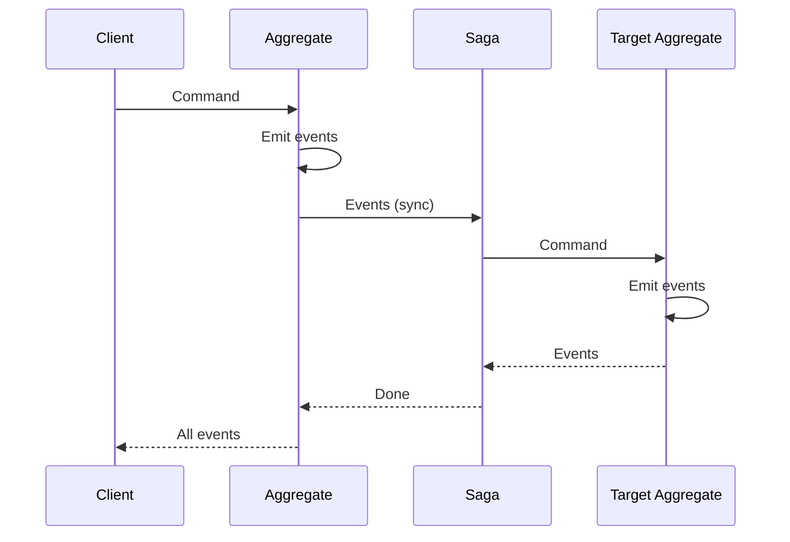

Synchronous saga execution. Execute a command and wait for the projectors, sagas and process managers it triggers before returning.

---

## The Problem

Event sourcing with sagas is naturally asynchronous: commands emit events, sagas react to events, and results arrive eventually. But sometimes you need immediate feedback:

- **User-facing operations** that need instant confirmation
- **Validation workflows** that must complete before responding
- **Multi-aggregate workflows** whose outcome the caller must see in the response

Cascade execution provides synchronous semantics while keeping event sourcing's append-only model: every event written along the way is an immutable fact. A failure part-way through is handled by compensation — new events that undo the business effect — never by hiding or rolling back events already written.

---

## Execution Modes

`SyncMode` on the `CommandRequest` decides how much downstream work the call waits for. Every mode persists the aggregate's events (or returns its rejection) before returning.

| Mode | Projectors | Sagas / PMs | Use Case |
|------|------------|-------------|----------|
| `ASYNC` | Async | Async | Default, highest throughput |
| `DECISION` | Async | Async | Caller (usually a PM) needs only accept/reject |
| `SIMPLE` | Sync, in response | Async | Read-your-writes consistency |
| `CASCADE` | Sync, in response | Sync, recursively | Immediate response, full coordination |
| `ISOLATED` | Never | Never | Replay / migration writes that must not trigger reactions |

An unset mode behaves as `ASYNC`. The caller's mode is a floor for the whole chain: a saga or process manager can raise the mode of a single emitted command with `PageHeader.sync_mode`, and that command runs with the stronger of the caller's mode and its own. A command's own mode never lowers it, so a `CASCADE` caller always observes the whole chain.

### Choosing Your Mode

```
Do you need immediate response?
    |
    +- NO → ASYNC (default)
    |       Highest throughput, compensation on failure
    |
    +- YES → Do you need more than accept/reject?
             |
             +- NO → DECISION
             |
             +- YES → Do you need saga results?
                      |
                      +- NO → SIMPLE
                      |       Sync projectors only
                      |
                      +- YES → CASCADE
                               Full sync: projectors + sagas + PMs
```

---

## CASCADE Mode

CASCADE executes the full coordination tree synchronously:



### Error Modes

When a saga, process manager, or one of the commands it emits fails, `CascadeErrorMode` controls the response. It applies only to `CASCADE`.

`CASCADE` gives **no ordering guarantee** among the reactions to one event, in-process or in-cluster: they may run in any order or concurrently. Which other reactions have run when one fails is therefore not defined—design reactions so every order is acceptable.

| Mode | On Failure | When to Use |
|------|------------|-------------|
| `FAIL_FAST` | Fail the request with the failure's reason; reactions not yet started may be skipped, reactions that ran keep their effects | Default, most operations |
| `CONTINUE` | Run every reaction; succeed and list failures in `CommandResponse.reaction_errors`, each with a machine `code` and a human-readable `message` | Batch validation |
| `COMPENSATE` | Fail the request and send a `Compensate` notification to the target of each reaction command that executed successfully | Undo partial work |
| `DEAD_LETTER` | Send each failure to the DLQ, run every other reaction, succeed | Best-effort with alerting |

With `COMPENSATE`, each target aggregate needs an undo handler (`undoes`) for every command type it may be asked to undo; a `Compensate` with no undo handler is dead-lettered. The notifications are recorded in the coordinator's compensation outbox before the failure is returned and are delivered at least once; each affected aggregate's compensation handler emits compensating events, and the compensated events stay in the stream. In every mode, the rejected reaction command's `RejectionNotification` is also delivered to its source aggregate. See [Graceful Failure](./compensation#delivery-guarantees).

---

## Usage

```rust
// Synchronous fan-out with the default error mode (FAIL_FAST)
let events = executor.execute_with_cascade(cmd).await?;

// Choose the error mode explicitly
let events = executor.execute_cascade_with_error_mode(
    cmd,
    CascadeErrorMode::Compensate
).await?;
```

---

## When to Use What

| Scenario | Recommended Mode |
|----------|------------------|
| Most workflows | ASYNC |
| Fire-and-forget notifications | ASYNC |
| High-throughput hot paths | ASYNC |
| PM needs accept/reject of one command | DECISION |
| UI needs its read model updated | SIMPLE |
| UI needs immediate feedback from downstream domains | CASCADE |
| Multi-step wizard with validation | CASCADE |
| Data migration / replay | ISOLATED |

---

## See Also

- [Graceful Failure](./compensation) — Compensation patterns
- [Error Recovery](../operations/error-recovery) — DLQ, retries, escalation
- [Saga Component](../components/saga) — Building sagas
- [Process Manager](../components/process-manager) — Stateful coordination
