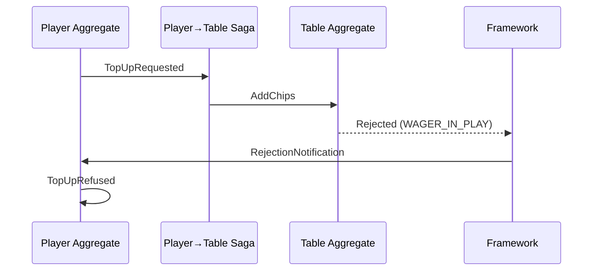

The wallet set money aside for a top-up. Then the table refused the chips because the player had a bet in play. Now what?

---

## The Problem

Distributed systems fail in the middle. A saga issues a command, the target aggregate rejects it, and now the source needs to know—and respond.

Traditional solutions—two-phase commit, distributed transactions—are complex, slow, and often unavailable across service boundaries. Event sourcing offers a different approach: let failures happen, record them, and compensate.

---

## How Compensation Works

When a saga issues a command that gets rejected:

```text title="illustrative - compensation flow"
1. Player emits TopUpRequested event (a hold is placed)
2. Saga (Player→Table) receives event, issues AddChips → Table
3. Table rejects: "WAGER_IN_PLAY"
4. Framework sends RejectionNotification directly to the Player aggregate
5. Player's @rejected handler emits compensation event: TopUpRefused (hold released)
```

The audit trail shows exactly what happened: the attempt, the rejection, and the recovery.

---

## The Flow



The rejection notification bypasses the saga entirely. The framework routes it directly to the source aggregate using the return address stamped on the original command. The saga is stateless—it doesn't need to know about rejections. The source aggregate decides how to compensate.

---

## Delivery Guarantees

A compensation notification is a durable obligation of the coordinator that raises it, never a fire-and-forget message:

1. **Recorded before acknowledgement.** The coordinator writes the notification to its compensation outbox before it acknowledges the trigger—the triggering event's delivery for a saga or process manager, or the response to a `CASCADE` request. If the outbox write fails, the trigger is not acknowledged and is redelivered.
2. **Delivered at least once.** The outbox delivers the notification to the target domain's `HandleCompensation`, including after a coordinator restart. Failed deliveries are retried with backoff.
3. **Deduplicated by the target.** The delivery carries the compensated command's provenance tuple (`source`, `source_seq`, `source_component`, `command_index`). The target's deduplication key is that tuple plus the kind — command, rejection notification or compensate notification — so a redelivered notification does not run the compensation handler again (it returns the first delivery's result), while a notification is never dropped as a duplicate of the command it concerns.
4. **Dead-lettered on exhaustion.** When the coordinator's configured outbox retry budget is spent, the delivery is published to `angzarr.dlq.{target domain}` with `compensation_delivery_failed` details (attempts and last error) for manual recovery.
5. **Rejections always reach their source.** In every sync mode — including a `CASCADE` request in `COMPENSATE` mode — a rejected saga/PM command's notification is delivered to its source aggregate.
6. **Never in the stream.** The notification itself is not persisted to the target's event stream. Only the events the compensation handler emits are.

---

## Handling Rejections

Register handlers for specific rejection scenarios:

```python title="illustrative - blackjack wallet compensating a refused top-up"
@rejected("table", "AddChips")
def on_add_chips_rejected(
    notification: types.Notification, state: PlayerState
) -> player_pb2.TopUpRefused:
    """The table refused a top-up: release the wallet's hold for it."""
    rejection = types.RejectionNotification()
    notification.payload.Unpack(rejection)
    add_chips = table_pb2.AddChips()
    rejection.rejected_command.pages[0].command.Unpack(add_chips)
    hold = state.holds[add_chips.hold_id.hex()]
    return player_pb2.TopUpRefused(
        hold_id=add_chips.hold_id,
        amount=hold.amount,
        reason=rejection.rejection_reason,
    )
```

The framework routes a rejection to the handler whose `compensates` entry matches the rejected command:

| Entry | Matches |
|-------|---------|
| `"table.AddChips"` | A rejected `table.AddChips`, whatever domain it was sent to |
| `"table:table.AddChips"` | A rejected `table.AddChips` sent to the `table` domain only |

Use the unqualified form by default—it is how an aggregate, which has no output domains, declares compensation for commands its events caused. Qualify with `domain:` only when the same command type goes to more than one domain and each needs a different compensation. A type is listed either once unqualified or once per domain, never both. Aggregates and process managers declare `compensates`; sagas and projectors never receive rejections. A rejection that matches no entry produces no compensation.

---

## Compensation in the Blackjack Example

Different failures require different responses:

| Scenario | Compensation |
|----------|--------------|
| Table refuses a top-up (bet in play) | Wallet releases the top-up hold (`TopUpRefused`) |
| Wallet cannot fund a buy-in | Buy-in process releases the held seat |
| Table refuses to confirm a seat | Buy-in process releases the funds and the seat |
| A round's follow-up fails under `COMPENSATE` | Wallet retracts the recorded round result |

The aggregate decides the business response. The framework ensures the notification arrives—at least once, and applied once.

---

## Rejection Code and Message

A `RejectionNotification` carries the reason twice:

| Field | For | Source |
|-------|-----|--------|
| `code` | Compensation logic — branch on it | `ErrorInfo.reason` in the rejecting handler's gRPC status (e.g. `WAGER_IN_PLAY`); empty if the rejection carried none |
| `rejection_reason` | People — logs, dead letters, UIs | The status message (e.g. `"cannot add chips while a wager is in play"`) |

Compensation handlers read `code`; they never parse `rejection_reason`, which is free text and may change wording at any time.

## RevocationResponse Options

When handling a rejection, you can specify additional actions:

:::info[Illustrative Example]
The following shows the RevocationResponse pattern. Your handlers will use
your domain's specific events and rejection reasons.
:::

```python title="illustrative - RevocationResponse options"
@rejected(domain="table", command="AddChips")
def on_add_chips_rejected(self, notification: Notification):
    rejection = RejectionNotification()
    notification.payload.Unpack(rejection)

    if rejection.code in ("WAGER_IN_PLAY", "TOP_UP_EXCEEDS_MAX"):
        # Return event directly—framework auto-applies it
        return TopUpRefused(reason=rejection.code)
    else:
        # Delegate to framework for DLQ/escalation
        return delegate_to_framework(
            reason=rejection.rejection_reason,
            send_to_dead_letter=True,
            escalate=True,  # Alert an operator
        )
```

| Flag | Effect |
|------|--------|
| `emit_system_revocation` | Emit `SagaCompensationFailed` event |
| `send_to_dead_letter_queue` | Route to DLQ for manual review |
| `escalate` | Trigger configured webhook (operator alert) |
| `abort` | Stop saga chain, propagate error |

---

## Multi-Step Compensation

Complex workflows may require compensating multiple steps:

:::info[Illustrative Example]
The following shows multi-step compensation patterns. Your implementation
will define domain-specific events for each compensating action.
:::

```python title="illustrative - multi-step compensation"
# Player tried to join table but verification failed
@rejected(domain="verification", command="VerifyPlayer")
def handle_verification_failed(self, notification: Notification):
    # Already reserved their seat and took their buy-in
    # Need to undo both—return multiple events as a tuple
    return (
        SeatReleased(seat=self.state.pending_seat),
        BuyInRefunded(player_id=self.state.pending_player, amount=self.state.pending_buyin),
        JoinRejected(player_id=self.state.pending_player, reason="verification_failed"),
    )
```

Each compensation event is recorded. The audit trail shows the full sequence: attempt, failure, recovery.

---

## Why This Matters

Regulated industries require demonstrable fairness:

- Every player action must be recorded
- Every rejection must be explained
- Every compensation must be traceable

When a regulator asks "why didn't this player's top-up reach the table?", the event history shows:
1. The top-up was requested and the money held
2. The table was asked to add the chips
3. The table refused (reason: a bet was in play)
4. The hold was released
5. The player's available balance was restored

No silent failures. No unexplained state changes.

---

## Compensate

Events are immutable facts: the framework never hides or deletes an event to undo it. Undo is business logic — a compensation handler emits new events that reverse the effect, and both the original and the compensating events stay in the stream.

### Compensate flow

When a `CASCADE` request with `CascadeErrorMode::COMPENSATE` fails, the coordinator raises one `Compensate` notification per reaction command that executed successfully (reactions run in no guaranteed order, so this can be any subset), addressed to that command's target aggregate. It is delivered exactly like a rejection notification (see [Delivery Guarantees](#delivery-guarantees)) and routed to the target aggregate's **undo handler** for the executed command's type, which emits inverse events.

```text title="Compensate flow"
1. Coordinator records Notification(Compensate { command_type: "inventory.ReserveStock",
   sequences: [5], reason: "card declined" }) in its compensation outbox, then fails
   the CASCADE request
2. Outbox delivers it to the target's HandleCompensation
3. The ReserveStock undo handler receives the compensated events, emits inverse
   (e.g., InventoryReleased)
4. Original and compensating events are in the stream; the notification is not
```

Compensation fits because:
- Business logic must decide how to undo
- Partial undo based on context
- Explicit audit trail required (both events visible)
- Third-party notifications or side effects need reversal

### Declaring Undo Handlers

An aggregate declares the commands it can undo with `undoes` on its component options. It is separate from `compensates`, which handles *rejections of commands the component caused elsewhere*:

| Declaration | Handles | Payload | Allowed on |
|-------------|---------|---------|------------|
| `compensates` | Rejection of a command this component caused | `RejectionNotification` | Aggregates and process managers |
| `undoes` | Undo of a command this aggregate executed | `Compensate` | Aggregates only |

Process managers, sagas and projectors never execute commands, so they declare no `undoes`.

```protobuf title="illustrative - undo declaration"
message InventoryState {
  option (io.angzarr.v1.component) = {
    kind: COMPONENT_KIND_AGGREGATE
    domain: "inventory"
    undoes: "inventory.ReserveStock"
  };
}
```

Code generation emits one undo handler per entry (e.g. `OnReserveStockUndo`), and the generated dispatch routes each `Compensate` by its `command_type`:

```python title="illustrative - undo handler"
def on_reserve_stock_undo(self, state, compensate):
    # The compensated events remain visible; emit the inverse
    return InventoryReleased(sku=state.sku, qty=state.reserved_qty, reason=compensate.reason)
```

A `Compensate` for a command with no undo handler is **never dropped**: the aggregate answers `UNIMPLEMENTED` and the coordinator dead-letters the delivery immediately (`compensation_delivery_failed`), so an operator sees every undo that could not run.

### What the Stream Holds

| Item | In the target's stream |
|------|------------------------|
| `Compensate` / `RejectionNotification` notification | Never written |
| Compensated event | **Visible** |
| Compensating events | Visible |

---

## See Also

- [Cascade Execution](./cascade) — Synchronous fan-out and cascade error modes
- [Error recovery operations](../operations/error-recovery) — DLQ, retries, and escalation
- [Saga component](../components/saga) — Building sagas
- [Why Blackjack](../examples/why-blackjack) — Full example with compensation flows
