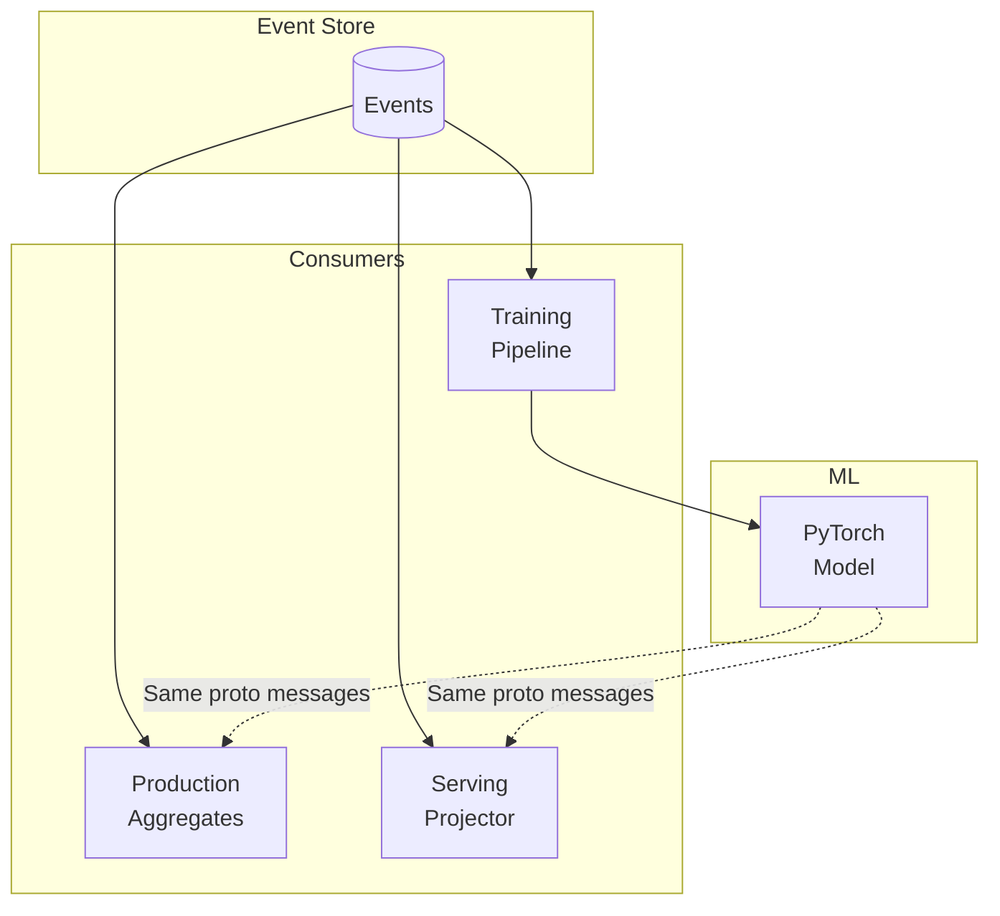

Your event store is already a dataset. Editions let you generate synthetic scenarios. PyTorch sees the same proto messages your production code handles.

---

## The Opportunity

Every event in your system carries:
- The state before the decision
- The decision made (command/action)
- The outcome (resulting events)

For supervised learning, this is labeled data. For reinforcement learning, this is experience replay. For anomaly detection, this is the normal distribution.

And you already have it.

---

## Event Streams as Training Data

### Reading Historical Events

```python title="illustrative - PyTorch dataset"
import torch
from torch.utils.data import IterableDataset

class EventDataset(IterableDataset):
    def __init__(self, domain: str, event_types: list[str]):
        self.domain = domain
        self.event_types = event_types

    def __iter__(self):
        for event_book in stream_events(self.domain, self.event_types):
            # Extract features from state + event
            features = extract_features(event_book)
            label = extract_label(event_book)
            yield torch.tensor(features), torch.tensor(label)

# Use with DataLoader
dataset = EventDataset("table", ["CardDealt", "HandStood", "RoundSettled"])
loader = DataLoader(dataset, batch_size=32)
```

### Same Proto, Different Context

The proto messages your aggregate handles are the same messages your training pipeline consumes:

```python title="illustrative - shared proto messages"
# In aggregate
def handle_hit(cmd: Hit, state: TableState):
    # Business logic
    ...

# In training pipeline
def extract_features(event_book: EventBook) -> np.ndarray:
    state = rebuild_state(event_book)
    # Same TableState, same fields
    seat = state.seated[state.turn]
    return np.array([
        seat.hand.total,
        seat.hand.soft,
        state.dealer_cards[0].rank,
        ...
    ])
```

No translation layer. No ETL. The types are the contract.

---

## Generating Counterfactuals with Editions

Real history gives you one path. Editions let you explore alternatives.

### Example: Hit-or-Stand Training

```python title="illustrative - counterfactual generation"
def generate_training_data(decisions: list[Decision]):
    samples = []

    for d in decisions:  # each point where a player hit, stood or doubled
        # Get the actual outcome
        actual = get_event_book("table", d.table_id)
        samples.append(extract_sample(actual, d, is_actual=True))

        # Generate counterfactuals: every other legal action
        for i, action in enumerate(other_actions(d)):  # Hit / Stand / DoubleDown
            edition = Edition(name=f"train-{d.table_id.hex()}-{d.sequence}-{i}", divergence=d.sequence)

            # What would have happened?
            result = speculate(command=action(seat=d.seat), domain="table", root=d.table_id, edition=edition)

            samples.append(extract_sample(result, d, is_actual=False))

            # Cleanup
            delete_edition_events(domain="table", edition=edition.name)

    return samples
```

Each counterfactual is a complete simulation through your actual aggregate logic—not a simplified model.

---

## Training Patterns

### Supervised Learning

Predict outcomes from state:

```python title="illustrative - supervised learning loop"
# Labels: did the player win the round?
# Features: player total, soft/hard, dealer up-card at the decision point

model = RoundOutcomePredictor()
for features, label in loader:
    pred = model(features)
    loss = criterion(pred, label)
    loss.backward()
    optimizer.step()
```

### Reinforcement Learning

Event history as experience buffer:

```python title="illustrative - RL experience buffer"
class RoundExperienceBuffer:
    def __init__(self, domain: str):
        self.domain = domain

    def sample(self, batch_size: int):
        rounds = sample_rounds(self.domain, batch_size)
        experiences = []
        for rnd in rounds:
            state = extract_state(rnd)
            action = extract_action(rnd)          # hit, stand or double
            reward = extract_reward(rnd)          # net from RoundSettled
            next_state = extract_next_state(rnd)
            experiences.append((state, action, reward, next_state))
        return experiences

# Use with any RL algorithm
buffer = RoundExperienceBuffer("table")
for epoch in range(1000):
    batch = buffer.sample(32)
    train_step(agent, batch)
```

### Anomaly Detection

Learn normal patterns, flag deviations:

```python title="illustrative - anomaly detection"
# Train on historical events
normal_events = stream_events("transactions", ["TransactionCompleted"])
autoencoder = train_autoencoder(normal_events)

# Flag anomalies in real-time via projector
@handles("TransactionCompleted")
def detect_anomaly(event: TransactionCompleted, state):
    features = extract_features(event)
    reconstruction_error = autoencoder.reconstruction_error(features)
    if reconstruction_error > threshold:
        alert(event, reconstruction_error)
```

---

## Integration Architecture



---

## Why Not a Separate ML Pipeline?

| Traditional Approach | Angzarr Approach |
|---------------------|------------------|
| ETL from production DB | Read events directly |
| Schema drift issues | Proto is the contract |
| Stale training data | Real-time event streams |
| Simulation != production | Same aggregate logic |

The event store is the single source of truth for both production and training.

### When You Want Isolation

Direct event access works well for many workloads. But if your training jobs are heavy and you need to isolate load from production, ETL to an external store is straightforward:

- Export events to a data lake (S3, GCS, HDFS)
- Replicate to a read replica dedicated to ML workloads
- Stream to a separate analytical store (ClickHouse, BigQuery)

The proto schema travels with the data. Your training code still sees the same messages—just from a different backing store.

Start by training directly against the event store. When load becomes a concern, migrate to isolated infrastructure. No upfront complexity tax.

### Replay from External Sources

Events stored in your data warehouse can flow back through Angzarr. Replay them through the same domains to rebuild state, or route them through entirely different domains to test new aggregate logic, run backtests, or generate derived datasets.

The event store doesn't have to be the origin. Any source that produces valid proto messages can feed the system.

---

## See Also

- [Editions](./editions) — Temporal branching for counterfactuals
- [Projections](./projections) — Building ML feature stores
- [Polyglot](./polyglot) — Python for ML, Rust for production
