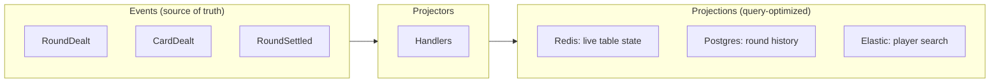

The table UI needs millisecond updates. The analytics team needs round histories in a data warehouse. The mobile app needs a different shape entirely.

One event stream. Many projections. Each optimized for its purpose.

---

## The Concept

A **projection** is a query-optimized view built from events. It's the "read side" of CQRS—derived data structured for fast retrieval, not for recording history.



The event store is the source of truth. Projections are disposable views—rebuild any of them by replaying events.

---

## Why Multiple Projections?

Different consumers have different needs:

| Consumer | Needs | Projection |
|----------|-------|------------|
| Table UI | Real-time state, low latency | Redis cache |
| Round history | Complete replay, searchable | Postgres with indexes |
| Player search | Full-text, fuzzy matching | Elasticsearch |
| Analytics | Aggregations, time series | Data warehouse |
| Mobile app | Minimal payload, denormalized | Custom API cache |

One event stream serves all of them. Each projection uses the storage that fits its query pattern.

---

## Projector Handlers

A projector subscribes to events and updates its storage:

```python title="illustrative - projector handler"
@projector("table-state")
class TableStateProjector:
    def __init__(self, redis: Redis):
        self.redis = redis

    @handles("PlayerSeated")
    def on_player_seated(self, event: PlayerSeated):
        self.redis.hset(
            f"table:{event.table_id}",
            f"seat:{event.seat}",
            json.dumps({"player_id": event.player_id, "stack": event.stack})
        )

    @handles("CardDealt")
    def on_card_dealt(self, event: CardDealt):
        self.redis.hset(
            f"table:{event.table_id}",
            "last_action",
            json.dumps({"seat": event.seat, "card": card_name(event.card), "total": event.total})
        )
```

The projector receives events, transforms them, and writes to its target storage. No business logic—just data transformation.

---

## Sync vs Async

| Mode | Use Case | Behavior |
|------|----------|----------|
| **Async** (default) | Analytics, indexing | Fire-and-forget, eventually consistent |
| **Sync** | Read-after-write | Command waits for projectors to complete |

Projectors just project—they don't know or care about sync mode. The **caller** specifies sync mode when sending commands:

```python title="illustrative - sync mode selection"
# Default: async, returns immediately
send_command(DepositFunds(amount=1000))

# Sync: framework waits for projectors, returns their results
send_command(
    DepositFunds(amount=1000),
    sync_mode=SyncMode.SYNC_MODE_SIMPLE,
)
```

The framework decides whether to return projection results to the caller. The projector code is identical either way.

---

## Rebuilding Projections

Projections are disposable—in theory. Schema change? Bug fix? Rebuild:

```bash title="illustrative - projection rebuild"
# Clear and rebuild from event history
angzarr projection rebuild --projector=projector-round-history --from=0
```

The event store is immutable. The projection is derived. You can always reconstruct.

### A Note on "Disposable"

Small projections rebuild in seconds. Large projections—years of transaction history, millions of events—can take hours and cost real money in compute and storage I/O.

Architects should plan accordingly:
- **Retention policies**: Do you need every event forever, or can older data age out?
- **Incremental rebuilds**: Can you rebuild from a checkpoint rather than from zero?
- **Backup projections**: For critical read models, consider snapshotting the projection itself
- **Cost modeling**: Estimate rebuild time and cost before assuming "we'll just rebuild"

For large projections, it may be cheaper to maintain and migrate them than to rebuild from scratch. "Disposable" means you *can* rebuild, not that you *should*.

---

## Position Tracking

The framework tracks each projector's position in the event stream:

```text title="illustrative - position tracking"
Projector: projector-round-history
Domain: table
Last processed: sequence 45,832
Status: caught up
```

On restart, the projector resumes from its last position. No events missed, no duplicates.

---

## Example: Round History for Blackjack

```python title="illustrative - round history projector"
@domain("table")
class RoundHistoryProjector(Projector):
    name = "projector-round-history"

    def __init__(self, store: RoundHistoryStore):
        self.store = store

    @handles("RoundDealt")
    def handle_round_dealt(self, event: RoundDealt, table_id: bytes):
        self.store.open_round(table_id, event.round, event.hands, event.dealer_up)

    @handles("CardDealt")
    def handle_card_dealt(self, event: CardDealt, table_id: bytes):
        self.store.record_card(table_id, event.seat, event.card, event.total)

    @handles("RoundSettled")
    def handle_round_settled(self, event: RoundSettled, table_id: bytes):
        self.store.close_round(table_id, event.round, event.outcomes, event.house_delta)
```

The read model is a plain domain object — `RoundHistoryStore` exposes business-oriented methods (`recent_rounds_for(player_id)`, `cards_in(table_id, round)`) and hides the storage backend. Projectors translate events into calls on that interface; callers query it through the same interface.

---

## Multi-Domain Projectors

Projectors can subscribe to multiple domains when necessary. Use `input_domain` on each `@handles` decorator to specify which domain the handler subscribes to:

```python title="illustrative - multi-domain projector"
class LeaderboardProjector(Projector):
    name = "projector-leaderboard"

    @handles(PlayerRegistered, input_domain="player")
    def on_player_registered(self, event: PlayerRegistered):
        self.create_player_entry(event.player_id)

    @handles(RoundSettled, input_domain="table")
    def on_round_settled(self, event: RoundSettled):
        for outcome in event.outcomes:
            self.update_player_stats(outcome.player_root, outcome.net)
```

Use sparingly. Multi-domain projectors often indicate a domain boundary issue.

---

## Projection Patterns for Card Tables

| Pattern | Use Case | Implementation |
|---------|----------|----------------|
| Live state | Table UI | Redis with pub/sub |
| Audit log | Compliance | Append-only Postgres |
| Analytics | Business intelligence | Snowflake/BigQuery |
| Search | Player lookup | Elasticsearch |
| Cache | API responses | Redis with TTL |

Each optimized for its query pattern. All derived from the same events.

---

## See Also

- [Projector component](../components/projector) — Implementation details
- [Performance](./performance) — Scaling projections
