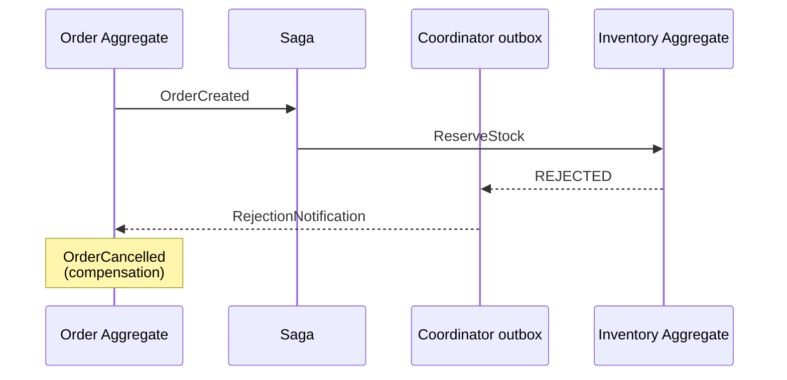

# Compensation

The process of handling failures in distributed workflows by emitting events that undo or mitigate effects of prior events.

## When Compensation Occurs

1. Saga issues command to target aggregate
2. Target aggregate rejects the command
3. The coordinator records a [RejectionNotification](/glossary/notification) in its compensation outbox, then acknowledges the triggering event
4. The outbox delivers the notification to the source aggregate (at least once; deduplicated by the target)
5. Source aggregate emits compensation events

A `CASCADE` request in `COMPENSATE` mode follows the same delivery path with a `Compensate` notification, addressed to each aggregate whose reaction command executed successfully.

## Flow Diagram

## Provenance

The rejected command's `angzarr_deferred` header carries the routing and deduplication key:
- `source` — triggering aggregate (domain, root, edition)
- `source_seq` — triggering event sequence
- `source_component` — saga/PM name
- `command_index` — position in the emitted output

## Revocation

Response from compensation handlers indicating how to proceed:
- Continue with compensation
- Abort compensation flow
- Escalate to DLQ
